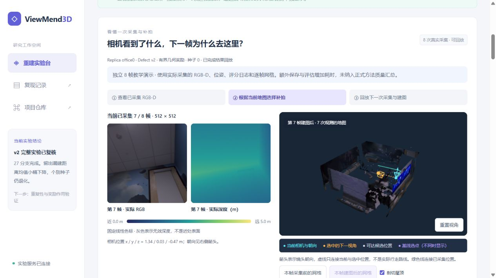
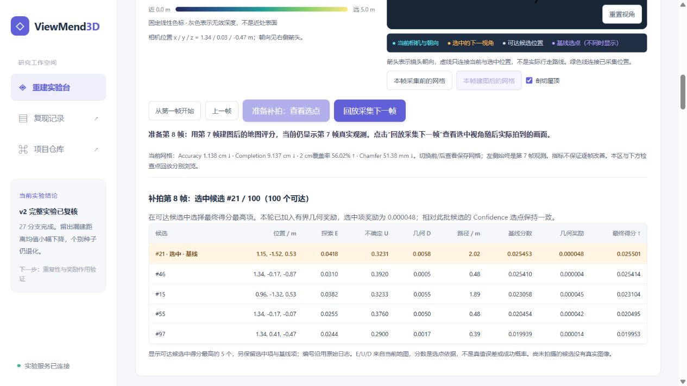
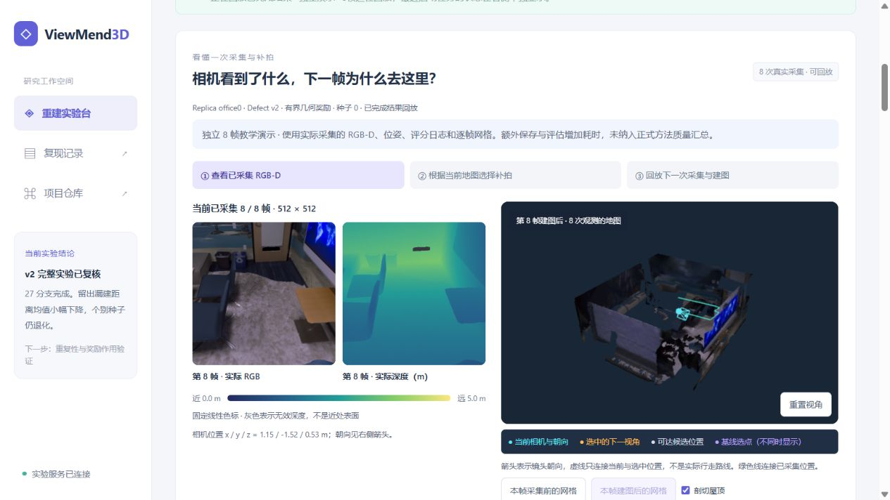
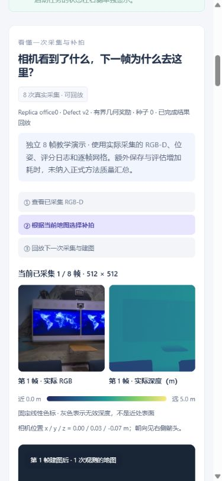

# 采集、选点与补拍过程回放

网页新增“相机看到了什么，下一帧为什么去这里？”区域。它与下方历史网格检查点浏览独立，展示一条专门记录的短演示，不加入 v1/v2 正式质量统计。

## 怎么看

1. 在“选择实验”选择 **独立演示 · 8帧过程回放**。左侧显示第 1 帧实际 RGB、实际深度和彩色深度图的固定米制色标；灰色代表无效深度。右侧显示该帧建图后的实际网格，青色相机和箭头表示当前位置与镜头朝向。
2. 点击 **准备补拍：查看选点**。地图与照片保持当前帧，显示下一帧决策日志中的可达候选位置、橙色选中相机与朝向。若同批候选的基线选择不同，紫色标出基线首选。虚线只连接两个位置，绿色线连接已采集位置，都不是规划出的导航路径。
3. 阅读候选评分表。E 是探索项，U 是不确定性，D 是当前地图几何不一致信号，路径长度单位 m。基线分数、几何奖励与最终得分均直接读取日志；显示最高分的 5 个可达项，并保留选中项及基线项。奖励未激活、随机回退或与基线相同会如实说明。这些分数不是真值误差、准确率或成功概率。
4. 点击 **回放采集下一帧**，才切换到下一次实际拍到的 RGB-D 和随后保存的网格。可以切换“本帧采集前 / 本帧建图后”的保存网格；左侧仍是该帧观测。第一帧之前没有保存的地图，因此禁用采集前按钮。
5. 重复上述操作到第 8 帧，或返回第一帧。此操作只回放已有产物；右侧启动面板才会创建新 GPU 实验。历史实验缺少逐帧数据时明确提示缺失，不合成图像或插值地图。

## 记录与边界

启动面板新增 **逐帧演示 · 8次采集**：固定 office0、Guarded v2、种子 0/1/2、1 帧初始化和 8 次实际观测，每帧保存地图。其余原作者入口和 60 次更新入口保持原协议。仅接受当前显存小于 1024 MiB、利用率不高于 5% 的设备；HTTP 与 worker/GPU 子进程入口均检查，已有任务或未知启动意图不重复启动。

`--record-replay` 只开放上述独立演示配置，不接受复用公共前缀缓存。实际选定视角调用 Habitat 传感器以后、建图以前保存 RGB PNG、固定线性米制深度预览 PNG、原始 float32 深度 NPY、位姿、内参与文件 SHA-256。候选规划仍只使用当前地图，不新增候选传感器查询。

导出核查全部 8 帧、8 份网格与相机计数，核对图像哈希、原始深度形状/有效像素、选中候选位姿、日志事件、最大得分与零候选未来观测查询。第 i 帧的决策选出第 i 帧；因此回放当前第 i 帧的“下一帧选点”使用第 i+1 帧日志。原始深度留在实验目录，仅 PNG 和必要日志字段用于网页。

保存 RGB-D、逐帧地图以及每帧完整网格评估增加 IO 和耗时，不能将此演示成本直接与冻结的正式实验比较。它解释闭环、证明演示能运行；8 帧或单个种子的指标不能证明模型优化有效。已有正式汇总、冻结分析与退化结论保持不变。

## 运行入口

按[界面使用说明](demo-interface.md)启动服务和 SSH 转发，在网页启动新演示。CLI 等价示例（GPU 编号须当时空闲，输出目录必须新建）：

```bash
.envs/activegs/bin/python scripts/activegs/run_benchmark.py \
  --upstream /workspace/ViewMend3D/external/active-gs \
  --run-dir /workspace/ViewMend3D/runs/my-replay-demo --gpu 1 \
  --recipe optimization-v2 --methods defect_guarded --seeds 0 \
  --campaign-spec-sha256 d3802aa30065a1a38c25dcd0a742440cc0440b8791519c0cf2a489bbfd53f541 \
  --protocol observations --frames 8 --prefix-frames 1 \
  --checkpoint-every 1 --record-replay
```

网页 worker 自动评估与导出，CLI 完成后按既有 `export_run.py` 用法导出该分支。原始观测、地图、缓存和运行输出在 `.gitignore` 保护的 `runs/` 下，不入仓库；队员需要已有数据和 GPU 环境才能运行新的真实采集。

CPU 验证：8 项记录/导出/启动约束检查，以及全部 8 帧的浏览器状态对应契约。CPU 合成夹具仅验证程序约束，真实演示验收另行记录。

## 真实演示验收（2026-10-06）

独立运行 `web-replay-20261006T141303Z-ae2d2b` 使用物理 GPU 1，入场显存 19 MiB、利用率 0%。冻结运行源码提交为 `3b7cee2`，真实科学源码哈希、图像哈希、逐帧候选及网格验收见[记录](reproduction/evidence/capture-replay-acceptance.json)。8 次实际采集、8 份非空网格与评估、网页导出全部完成，完整流水线墙钟 390 秒；worker 与 child 均已退出。

第 1 帧初始化，第 2—8 帧每轮 100 个候选，规划候选真值传感器查询为 0。全部 RGB-D 哈希、相机位姿/内参、候选选点与逐帧地图计数已核对。公开运行列表由 54 条变为 55 条，仅增加这一独立演示；正式实验汇总与冻结完整分析 SHA-256 保持不变。

浏览器已逐一核对 7 次“准备补拍 → 采集下一帧”切换：准备时保留当前观测与地图，随后显示正确的下一帧 RGB-D 与网格；第 2 帧的采集前/建图后按钮和首末帧边界通过。页面 console 错误为 0。桌面可见内容宽度/滚动宽度均为 1265 px；390 px 手机视口中均为 375 px，两张图与三维视口完整留在卡片内，宽表格独立滚动。记录见[浏览器验收](reproduction/evidence/capture-replay-browser.json)。

下面是实际浏览器截图。青色是当前相机，橙色是下一次选中的位置与朝向；评分与图像来自同一条演示的原始产物。








