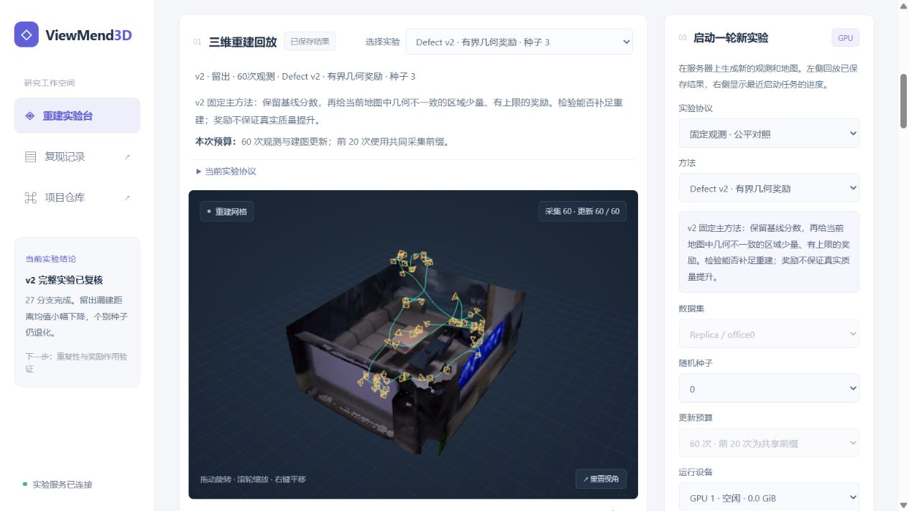
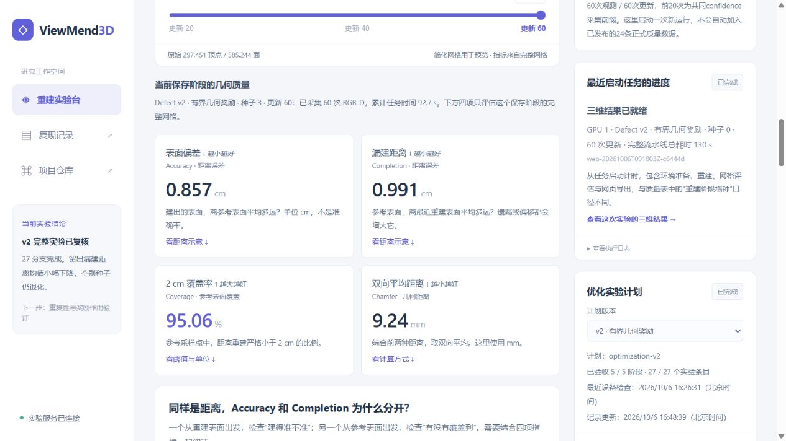
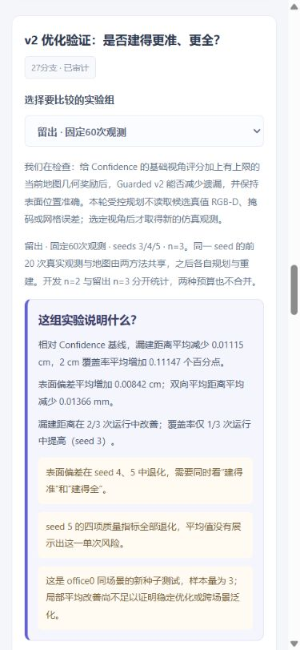
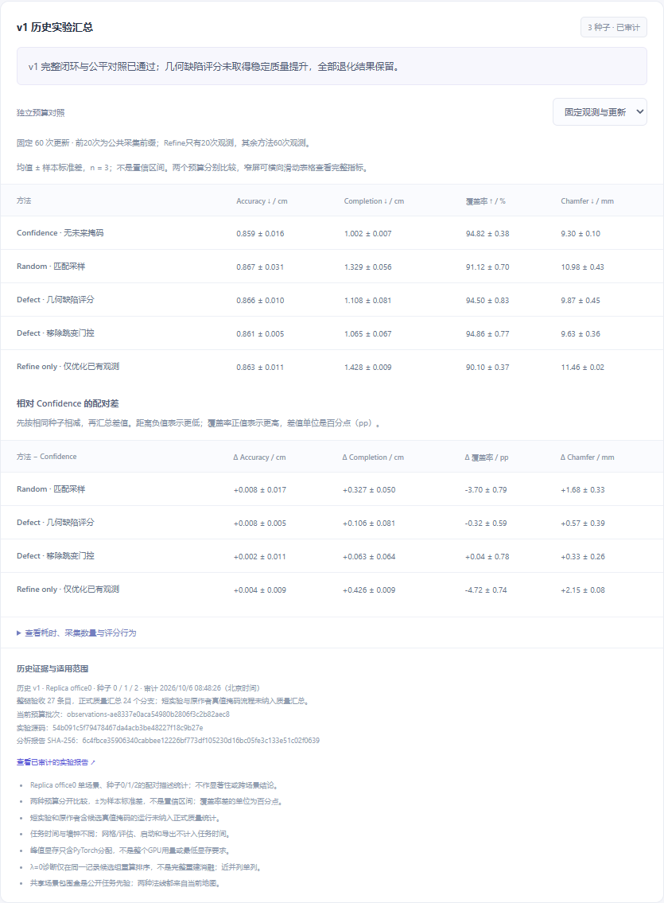
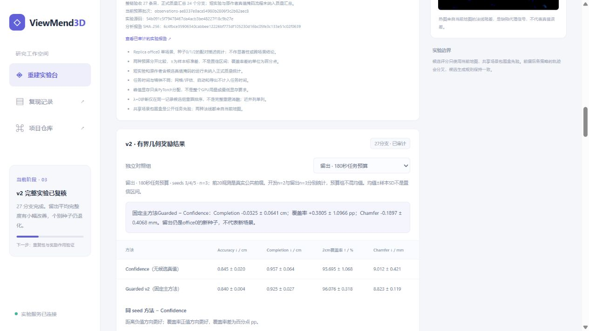
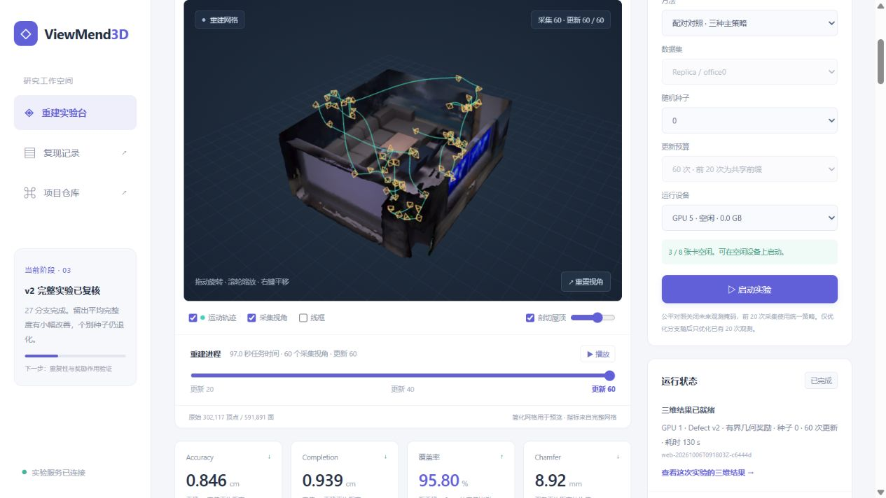

# ViewMend3D 重建实验台

新增[采集 → 选点 → 补拍过程回放](capture-replay.md)：独立8帧演示显示实际RGB-D、下一视角位置/朝向与候选评分，以及本帧采集前后的保存网格。历史实验无逐帧记录时明确提示缺失。启动面板可选择“逐帧演示 · 8次采集”；该演示不加入正式质量汇总。

浏览器界面展示已完成的 **ActiveGS confidence + Replica office0**、24份v1正式公平实验及v2四组24份正式结果，支持启动原作者流程、v1公平方法或v2有界几何奖励方法的新实验。v1未取得稳定质量提升；v2五阶段27分支已完成导出与fresh审计，留出均值局部改善，但种子/Accuracy等权衡仍未稳定。全部结果见[v1报告](reproduction/optimization-v1-results.md)和[v2报告](reproduction/optimization-v2-results.md)，协议见[受控实验说明](controlled-experiments.md)。

## 第一次打开，按这个顺序读

页面顶部提供五个阅读入口。先理解项目在做什么，再看结果和比较，最后启动新实验。

1. **我们在做什么：四步闭环。** 选定位置取得一帧彩色图与深度图（RGB-D）→用图像和相机位姿更新三维地图→给下一批候选视角评分→移动到选中的位置，再取得新观测。我们优化的是第三步。Guarded v2 保留 Confidence 的基础评分，加入少量有上限的当前地图几何奖励，希望兼顾“建得准”和“建得全”。
2. **看真实三维回放。** 在“选择实验”中选方法与随机种子，拖动阶段滑块查看已保存网格。彩色表面是重建结果，绿色线是运动路径，黄色相机框是已采集视角。当前实验说明、观测数、更新数和下方四项指标随检查点一起切换；右侧最近任务的运行进度单独显示。这里回放保存阶段，不是逐帧实时重建视频。
3. **读懂四项指标。** 先看 Accuracy/Completion 两个方向的距离示意，再看单位、改善方向和覆盖率阈值。曲线只连接当前这一次实验的保存检查点，不能代替多种子方法比较。增加观测也不保证所有误差单调下降。
4. **比较 v2 方法。** v2 汇总放在 v1 历史结果之前；v1 历史区默认折叠，原数据仍保留。选择开发/留出、固定观测/任务时间四个独立组，先读本组结论，再看原值、配对差与每个 seed。每个种子都有 **Confidence 基线**和 **Guarded v2 主方法**的真实网格入口，点击会切换上方三维回放。成本、局部改选和来源指纹可展开查看。
5. **启动新实验。** 选择协议、方法、种子与空闲 GPU，先读方法解释和预算说明，再启动。完成后看右侧状态与日志，切换到新保存结果。这是新的单次运行，不自动加入已发布的 v2 正式24条质量样本。

### 四项指标分别说明什么

评估在完整网格上进行；网页简化预览不会改动指标。公平实验从重建网格和参考网格各按表面积加权均匀采样 500,000 点，计算最近点距离，不使用平方距离。较大面积的三角面会分到更多采样点，不是每个面取相同点数。

| 页面名称 / 原名 | 含义 | 单位与方向 |
| --- | --- | --- |
| 表面偏差 / Accuracy | 从重建表面出发，到最近参考表面的平均距离：建出的位置偏了多远？它是距离误差，不是准确率。 | cm，越低越好 ↓ |
| 漏建距离 / Completion | 从参考表面出发，到最近重建表面的平均距离：参考区域离已建表面有多远？遗漏与位置偏移都可能增大它。 | cm，越低越好 ↓ |
| 2 cm 覆盖率 / Coverage | 参考采样点中，距重建表面 **严格小于 2 cm** 的点所占比例。95% 不表示模型有95%的准确率。 | %，越高越好 ↑ |
| 双向平均距离 / Chamfer | 前两个方向的平均距离，统一单位后求平均。页面中 `Chamfer(mm) = 5 × [Accuracy(cm) + Completion(cm)]`。 | mm，越低越好 ↓ |

“同种子配对差”是同一个随机运行编号下的 **方法 − Confidence**；距离负值更好，覆盖率正值更好。覆盖率差用百分点 **pp**，例如95%变96%是+1 pp。**均值 ± SD** 中的SD是不同种子结果的样本标准差，用来描述波动，不是置信区间或质量保证。开发种子0/1（n=2）与留出种子3/4/5（n=3）、两种预算均分开统计；留出仍是同一个office0场景。

本轮数值与结论没有因界面改版而改变：留出固定观测的 Accuracy 均值退化，覆盖率仅 seed 3 改善；留出时间预算的 seed 4 四项质量全部退化。部分均值改善需要与这些权衡同时阅读，不能宣布稳定优化。诊断中的局部改选只比较 Guarded 自己同一地图、同一候选组的基础评分与加奖励评分，不等于与独立 Confidence 轨迹逐事件比较；奖励上限约束的是代理分数损失，不保证真实网格质量。

### 单次实验清单与正式汇总的区别

“已完成实验对比”每一行都是一次运行；它不会重新计算 v2 多种子统计。切换显示范围只是便于找结果。

| 显示范围 | 适合做什么 | 解释边界 |
| --- | --- | --- |
| 当前同种子 / 同前缀组（paired，默认） | 查看公平实验中已登记 `comparison_id` 一致的单种子方法对照。没有配对记录时只显示当前自身。 | 公平配对要求同种子、同预算协议、同公共前缀与实验来源；仍不能替代多种子结论。原作者流程未固定种子，是独立复现，即使有 `comparison_id` 也只显示自身，不与公平方法配对。 |
| 当前实验类别（stage） | 查看当前类别下的单次运行，各种子分别列出。 | 不混合计算均值；同类别不保证同预算。手动任务类别只是历史清单，不保证各行可直接配对。 |
| 全部已完成实验（all） | 查找原作者复现、v1、v2、短实验和手动运行。 | 跨批次的种子、前缀、预算或来源可能不同，不直接作为方法优劣证据。 |

### 任务预算、真实耗时与更新数

**任务时间 = 规划 + 建图 + 按路径估算的移动时间。** v2的180秒组在完成整次观测/更新后判断停止，因此最终计入预算的时间可能略超过180秒。**重建墙钟**是重建阶段实际耗时，包含公共前缀、采集、规划、建图及诊断/检查点写入；不含启动、前缀缓存保存/加载、网格生成与评估。网页导出另计。两种计时器应分别阅读，不能把180秒任务预算解释为点击后等待180秒。

右侧“最近启动任务”的**作业耗时**是新任务完整流水线的实际耗时，包含准备、重建、网格/评估和网页导出；它比质量汇总中的“重建墙钟”覆盖更多阶段。对比时不要把作业总耗时与正式实验的重建阶段耗时混用。

当前公平网页入口固定60次更新。普通采集方法完成60次观测/60次更新，每次更新10步地图优化，前20次采集为公共前缀；**Refine only 为20次观测/60次更新**，后40次只优化已有图像。**suite仍是v1三方法**（Confidence、Random、旧Defect），不包含Guarded v2。原作者入口提供60/180/300秒任务预算，与v2已发布的公平时间组分开；当前手动页面没有公平时间预算选择器。

## 本轮解释型界面更新（2026-10-06）

本轮调整阅读顺序、方法说明、指标示意、四组结论与比较入口，保留数据、方法参数和历史验收。真实公开汇总的CPU渲染契约检查已通过：四组各显示四项指标，20个方法/种子网格入口对应已审计导出；不可用数据不显示汇总数值，冻结验证逻辑未改。这些检查不证明质量提升。

**本轮浏览器验证已完成，界面实现提交为 `4d99f5c`。** 本次只读核查已存在的真实产物，没有提交新实验请求（零POST）：

- 四组切换、质量原值与退化说明正确；每组核对一个代表种子的 Confidence/Guarded 双网格入口，共8个真实网格入口联动通过。按钮定位到完整回放卡片，可同时看到方法、种子、预算与真实网格。CPU契约检查覆盖的20个入口与实际浏览器核对的8个入口分别记录。
- 验证时，单次清单为paired 2行、当前实验类别6行、全部54行。原作者独立复现的paired范围仅显示自身1行，并明确种子未固定。
- Refine真实结果为20次观测/60次更新；切换更新20的检查点时，网格、指标与覆盖率曲线联动。v1历史展开/折叠及时间预算切换通过。
- 新实验表单分别检查Refine、suite、原作者和Guarded的解释：只切换控件，未启动任务。本轮没有增加GPU质量实验或正式统计样本。
- 桌面实际内容宽与滚动宽均为1265 px；390 px手机视口中，两者均为375 px，无整页横向溢出。宽表格保持在344 px卡片中独立滚动。页面console错误为0。
- 冻结的完整分析SHA256保持为 `541b0effba87ae82928801a0ec2cfb26f4a5189674165c378a5ac7affadb61fd`；完整v2验证函数区与此前发布的 `1f1874e` 一致，实际公开汇总通过五阶段验证和留出退化断言。界面阅读方式改变，实验数据和质量结论未改。

以下为本轮实际浏览器截图；后文的v1/v2旧截图和真实启动器记录仍作为历史验收保留。








## 可以操作什么

- 旋转、缩放和平移三维网格；剖切屋顶，查看室内结构；切换线框。
- 切换或播放真实保存阶段；原作者5阶段、v1固定观测3阶段、固定时间4阶段，运动路径、采集相机和指标随阶段同步变化。
- 查看表面偏差 Accuracy / 漏建距离 Completion（cm）、2 cm 参考表面覆盖率（%）、双向平均距离 Chamfer（mm）及变化曲线，点击曲线记录点定位阶段。
- 查看真实初始 RGB 观测、原始网格顶点数和面数。
- 在原作者流程中选择空闲 GPU 和 60 / 180 / 300 秒任务预算，或在公平入口选择固定60次更新的方法；查看执行阶段和日志，完成后切换到新结果。
- 选择公平协议、种子 0/1/2 和单方法或三种主方法对照，执行 60 次更新。前 20 次为公共观测前缀；仅优化分支采集数始终为 20。
- 查看方法、种子、协议和已完成结果对比；有真实输出时显示选中候选的几何缺陷热力图。
- 查看自动实验计划的等待、阶段、已验收条目与进程状态。可选择v1历史或v2计划；v2顺序为短闭环、开发固定观测/时间、留出固定观测/时间，共5阶段27分支。这里只读显示，实际调度见[v2协议](optimization-v2.md)。
- v2诊断显示实际奖励、上限、回退原因和基线代理分数损失；“改选”指该方法自身当前地图上同次候选集的S0首选与S2首选不同。它不是与独立Confidence实际轨迹逐事件比较，局部零改选也不表示独立分支相同；分数约束不能证明几何质量改善。
- 查看v1历史汇总，两种预算分开显示三种子的均值±样本标准差、同种子配对差、成本和几何信号行为；该公开快照独立于当前任务状态，保留退化结论，±不是置信区间。
- 查看v2四组独立汇总：开发固定观测/固定时间（seeds0/1，n=2）、留出固定观测/固定时间（seeds3/4/5，n=3）。主方法固定Guarded；表格展示质量、配对差与成本，真实网格按钮关联具体方法/seed导出，不将四组合并为一个均值。

原作者入口沿用累计 mapping / planning / flight 时间，并非网页点击后的墙钟耗时；它包含初始观测检查、1,000 个评估视角生成、主动重建、网格生成、几何评估和网页导出。公平入口从公共前缀恢复，硬性禁止规划查询候选真值，使用统一的 500,000 点网格评估，无需生成未使用的测试相机。

## 在已配置的 GPU 服务器启动

以下路径对应当前已验证的安装布局；换机器时需先完成 [baseline 环境配置](reproduction/activegs-office0.md)。网页后端只依赖 Python 标准库；网格导出使用已安装的 ActiveGS Python 环境，不需要额外 Node 或 npm 安装。

```bash
cd /workspace/ViewMend3D
# 已有实验只需导出一次；数据与简化网格不提交 Git。
OMP_NUM_THREADS=4 OPENBLAS_NUM_THREADS=4 .envs/activegs/bin/python \
  scripts/web/export_run.py \
  runs/20261005-office0-original-02 \
  runs/web-assets/20261005-office0-original-02

# 服务仅监听 127.0.0.1，保留此进程运行。
python scripts/web/server.py --port 8765
```

Windows 本机使用已配置密钥的 SSH 别名转发端口，在另一终端运行：

```powershell
ssh -N -o ExitOnForwardFailure=yes -L 127.0.0.1:8765:127.0.0.1:8765 JM-New-Outside
```

然后在浏览器打开 **http://127.0.0.1:8765**。也可运行 `scripts/web/connect.ps1`；如果 SSH 配置未放在默认位置，传入 `-SshConfig '配置文件的完整路径'`。本机与服务器端口需一致。浏览器连接依赖服务器进程和 SSH 转发均保持运行。

## 数据与显示边界

- 首轮结果来自 2026-10-05 的 300 秒实测，5 个记录阶段，186 个采集视角，2,930 个实际运动路径位置。
- 浏览器默认将每阶段网格简化到约 80,000 个三角面。界面标注的原始顶点数、面数和全部评估指标来自完整网格；预览简化不会重算指标。
- 相机记录是 **OpenCV camera-to-world**，场景 **Z 轴向上**；每个阶段只显示当时已采集的相机及对应运动路径前缀，不显示未来路径或 1,000 个评估视角。
- 路径记录与采集相机数量必须匹配，否则导出拒绝生成 manifest。没有运动路径文件时，仅显示采集视角连线。
- 初始图像来自 Habitat RGB 传感器。当前流水线未保存完整 RGB 视频序列，页面不提供虚构视频或实时 RGB 画面。
- 当前是保存阶段浏览与实验管理，不提供逐帧实时 Gaussian Splatting 渲染。原作者结果含缺失表面候选掩码，公平入口关闭该查询；两类结果分开展示。

## 启动约束与验证

后端仅接受 office0 的固定协议：原作者三个时间预算，或公平 60 次更新、种子 0/1/2 和列出的方法。GPU 显存占用低于 1,024 MiB 且利用率不高于 5% 时才显示为空闲；接收请求和实际执行前各检查一次，不终止其他用户进程。每次使用独立 `runs/web-...` 目录。网页与自动实验推进器共享项目启动锁，核查彼此的启动记录和进程，只允许一个受管实验同时运行。此锁协调本项目的v1计划、v2计划与网页入口，无法锁住其他用户的程序或独立 CLI；服务器分配约定仍需遵循。

控制服务仅绑定回环地址，经 SSH 转发访问，检查 Host、Origin 和 JSON 请求头；不接受上传 pickle 或任意 shell 命令。已有实验导出会读取 **项目自己生成并信任的本地 pickle**，请勿替换为来源不明文件。此入口用于个人或课程组实验，不应直接发布为公网多用户服务。

已完成验证：

- 在真实服务器导出并加载首轮 5 个阶段的网格、实际相机/路径和指标。
- Edge 浏览器自动测试：WebGL 渲染无页面错误，首末阶段切换、曲线联动、剖切、线框及路径/相机开关通过；390 px 手机布局无横向溢出。
- 后端CPU检查覆盖原参数与固定公平协议、占用GPU拒绝、执行前复查、跨入口启动互斥、来源/路径限制、子进程登记、只读计划状态、失败与成功状态及多方法导出；v2还包含固定配方与双计划状态投影。历史验收记录见[CPU准备](reproduction/cpu-preparation-v2.md)及[v2冻结前记录](reproduction/optimization-v2-cpu.md)。
- 导出检查覆盖真实旧结果的浮点阶段编号、公共前缀诊断、采集与更新计数、路径端点和方法身份；接口及测试通过不代表新方法已完成 GPU 重建。
- 真实服务器启动请求在 GPU 全部占用时返回 409，未占用正在执行其他任务的 GPU。
- v1 CLI campaign已在空闲卡完成27条整链；24份正式预览、三种子缺陷热图、20观测/60事件Refine与时间预算的实际最终事件均已浏览器只读核对。v1历史汇总逐项匹配审计JSON，桌面和手机通过，零POST、零页面异常。
- v2五阶段27分支、27份真实导出已完成；最终fresh审计重新核查二进制/网格/实际相机、诊断与成本，正式24分支按四组分别汇总。页面识别v1/v2计划schema，完成状态来自真实state API；历史汇总与当前作业状态分开。
- **已完成一次真实HTTP启动→GPU重建→60次实际观测→3检查点→导出→completed及进程退出的完整验收**，未来候选观测调用为0。这条入口检查独立于正式27分支；后续启动器变更另立验收，不改变历史实验源与质量统计。不能据此声称其他硬件、所有参数组合或部署入口都已验证。



### v2 发布与直接启动器验收

2026-10-06，在提交 `fa19eeb984af2a6a5fd8cdbe7d6b3430325468b1` 上完成新入口验收。原 Shell 会在相同 PID 下切换成 Python，令登记的 argv 与实际进程不同；基准入口改为直接启动参数等价的 Python 子进程。四组合的真实 Shell/直接调用参数与环境等价检查、真实 Linux 进程身份检查及26项后端检查通过。

独立任务 `web-20261006T091803Z-c6444d` 在 admission 时的 GPU 1 仅占19 MiB、利用率0%。实际 worker 与 benchmark 子进程的 PID/starttime/argv 登记均匹配；完成60观测、600步优化、20/40/60三个检查点、完整40条后缀诊断及三维导出。122项输入指纹重新核对不变，未来候选观测调用为0，worker/benchmark/export均退出。该任务与此前成功的入口验收和正式27分支分别保留；不增加正式质量样本。详见[独立真实产物验收](reproduction/evidence/optimization-v2-web-launch-verification.json)。

浏览器实际核对四个独立组、逐seed退化、14项成本与信号、v1/v2完成状态以及真实结果按钮。新的手动任务网格、轨迹和completed可见；页面错误为0。390px布局无整页横向溢出，表格在卡片内横向滚动，验证后恢复桌面尺寸。Windows真实新clone开启autocrlf后，完整分析SHA不变，CPU生成的summary与服务器及仓库字节一致；这些检查证明发布和入口行为，不证明质量提升。





公开统计随clone提供，可在没有大型地图时读取；[v2完整最终分析](reproduction/evidence/optimization-v2-final-analysis.json)仅含指标、成本、诊断与来源元数据，原SHA256为 `541b0effba87ae82928801a0ec2cfb26f4a5189674165c378a5ac7affadb61fd`。可用发布工具在CPU上复现报告与图，命令见[受控实验说明](controlled-experiments.md)。真实三维预览仍需服务器上的 `runs/web-assets/`。成本展开表包含任务、重建墙钟、规划、建图、观测、路径与Torch峰值，不能把更少观测伴随的低耗时写成等质量加速。留出质量局部均值改善与seed/Accuracy退化同时保留，不因果归为奖励收益。

后端测试不依赖 GPU：

```bash
python scripts/web/test_server.py
```

## 文件位置

| 路径 | 内容 |
| --- | --- |
| `web/` | 中文界面、三维交互与曲线 |
| `web/vendor/` | 固定版本 three.js 0.186.1、OrbitControls、PLYLoader 及 MIT 许可证；无运行时 CDN 依赖 |
| `scripts/web/server.py` | 回环 HTTP 服务、GPU 状态、受约束的实验启动与日志 |
| `scripts/web/export_run.py` | 原始实验产物 → 简化 PLY 与 JSON manifest |
| `scripts/web/connect.ps1` | Windows SSH 转发与浏览器入口 |
| `runs/web-assets/` | 本机实验预览，Git 忽略 |
| `runs/web-jobs/` | 作业状态、worker 日志，Git 忽略 |

可视化依赖使用 [three.js 官方发行包](https://registry.npmjs.org/three/0.186.1)，导出使用 [Open3D 网格简化](https://www.open3d.org/docs/release/tutorial/geometry/mesh.html#Mesh-simplification)。Replica 数据和派生网格留在 GPU 服务器，遵循研究与教学使用范围。
