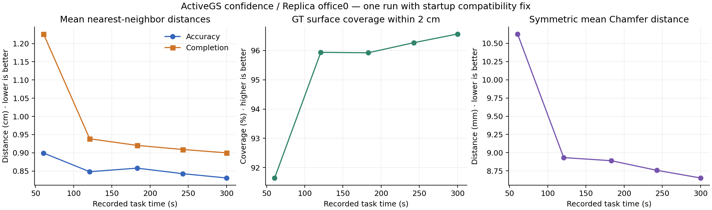
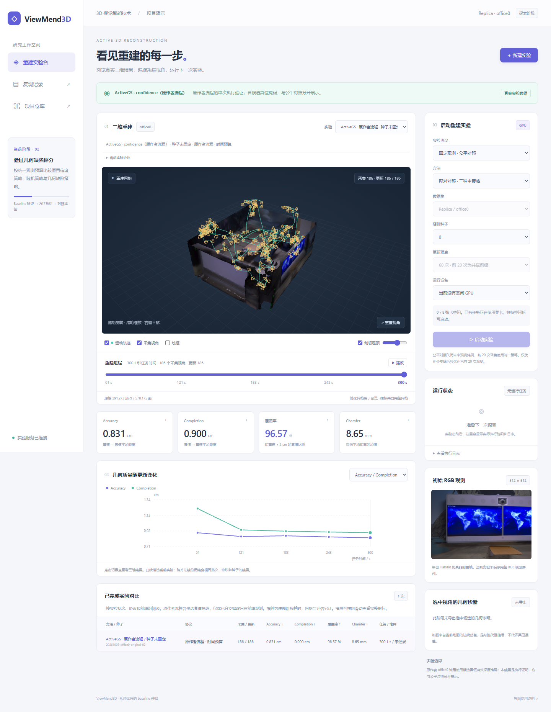

# ViewMend3D 当前项目说明

更新日期：2026-10-06。本文供项目队员了解当前方向、已完成工作、实际运行方式和下一阶段任务。

**项目从零探索，现已完成原方法复现与两轮单场景优化验证。ActiveGS 原始 confidence 方法和 Replica office0 已完成GPU验证，并建立了可视化界面。v1完成27条实验，24条正式对照未取得稳定质量提升；v2另完成五阶段27条实验、导出和fresh审计，24条正式分支分别统计。两轮全部结果、退化与成本均如实保留。**

项目仓库：[SCUTLZH684/ViewMend3D](https://github.com/SCUTLZH684/ViewMend3D)。

继续优化按[v2预注册协议](optimization-v2.md)完成：在基线最终分数上加有上限的当前地图几何奖励，批量计算几何项。短闭环、开发种子0/1及留出种子3/4/5均完成，两种预算与两种划分形成四组独立统计。留出Completion和覆盖率的部分均值方向有利，但并非所有种子或指标改善；Accuracy与成本也有权衡，不能宣称稳定提升或把全部质量差归因于奖励。详见[v2完整结果](reproduction/optimization-v2-results.md)，v1历史数据保留，仍只验证office0。

## 1 项目目标与研究问题

暂定方向为“几何缺陷驱动的主动三维重建”。程序从有限的 RGB-D 观测建立三维地图，再根据当前地图决定下一次相机应该移动到哪里、朝哪个方向拍摄。我们希望在统一采集预算下，获得覆盖更完整、几何误差更小的重建结果。

例如，桌子正面已经获得足够观测，但侧后方覆盖不足，系统应考虑选择有助于补充这些区域的视角。需要研究的核心是如何从已有观测和当前重建识别不足，以及如何把这些信息转化为候选视角的评分。

本项目的算法改进重点暂定在下一视角选择环节。网页用于三维结果展示和实验管理；是否能够提升重建质量，必须由后续对照实验验证。课程成果将包括源代码、可运行测试与数据获取说明、三维演示、实验结果和报告。

## 2 数据集与输入输出

当前使用 [Replica](https://github.com/facebookresearch/Replica-Dataset) 中的 office0 办公室场景，下载目录名为 `office_0`。Replica 提供已经制作好的室内三维场景，可以在 Habitat 模拟器中从指定相机位置生成新观测。

| 数据文件 | 具体形式 | 当前用途 |
| --- | --- | --- |
| `mesh.ply` | 三维顶点、面片和颜色 | 场景几何与重建评估参考 |
| `textures/` | PTex HDR 纹理和参数 | 为模拟器提供场景外观 |
| `habitat/` | 场景配置、相关网格、导航与渲染文件 | 加载场景并渲染相机观测 |
| `semantic.*`、`preseg.*` | 语义、实例与平面分割信息 | 当前流程未使用 |

实际下载的 `office_0.zip` 为 744,494,396 字节，约 0.74 GB；解压文件合计 1,000,725,289 字节，约 1.00 GB。该大小只包含场景资产，不包含 Python/CUDA 环境、模型缓存和实验产物。归档 CRC 与 SHA256 已校验，详见[数据记录](reproduction/evidence/office0-download.json)。

每次选择相机位姿后，Habitat 生成 RGB 图像、深度图，以及对应相机参数。当前观测分辨率为 512 × 512；RGB 具有三个颜色通道，深度表示像素对应的距离。重建流程利用这些逐次采集的 RGB-D 和相机参数更新地图。

已有场景用于提供模拟环境和评估参考。项目需要从采集的观测生成自己的重建结果，再与参考网格比较。最终输出包括 Gaussian 地图、采集相机、运动路径、三角网格和几何指标。数据及大型产物保存在 GPU 服务器，不随 Git 仓库发布；使用数据时应遵守 [Replica 许可](https://github.com/facebookresearch/Replica-Dataset/blob/main/LICENSE)和引用要求。

## 3 实现基础与技术流程

采用的是 [ActiveGS 作者仓库](https://github.com/dmar-bonn/active-gs)，对应论文 ActiveGS: Active Scene Reconstruction Using Gaussian Splatting。它是前期调研的候选实现之一，已被选为当前可复用的 baseline。NBV-Gym 与 DTU 保留为备选路线，尚未接入本项目的 GPU 实验。

当前闭环为：选择初始相机 → Habitat生成RGB-D → 更新Gaussian表面与体素地图 → 按confidence或缺陷评分选择下一视角 → 采集新观测 → 更新地图；按阶段保存地图，随后提取三角网格并评估几何质量。

| 组件 | 作用 | 当前来源与状态 |
| --- | --- | --- |
| Habitat 模拟器 | 在 Replica 中模拟相机拍摄 | 使用作者指定 fork，已验证 |
| Gaussian 与体素建图 | 利用 RGB-D 增量更新三维地图 | 复用 ActiveGS 原实现 |
| confidence 规划器 | 根据置信度等信息选择下一视角 | 已运行的原始 baseline |
| 网格生成与评估 | TSDF 融合生成网格并计算几何指标 | 复用作者实现，已验证 |
| 实验脚本和检查 | 串联阶段、保存日志、核对产物 | 本项目新增 |
| 浏览器实验台 | 三维交互、指标展示、运行管理 | 本项目新增，界面测试通过 |
| 几何缺陷评分 | 表面法线与当前预测深度法线的不一致代理 | v1真实GPU闭环与诊断通过，质量未稳定改善 |
| 有界几何奖励 | 保留基线最终分数，加上限为β/可达候选数的当前地图奖励 | v2固定β=0.1，批量几何计算，五阶段27分支已验收 |
| 公平实验与消融 | 禁止候选真值查询、恢复公共前缀、隔离随机域 | v1两预算24正式分支；v2四组24正式分支独立汇总 |

ActiveGS 固定在提交 `558121a00b2eca84d9851a609e99ebb8e26ea2d8`。首次运行遇到多进程上下文重复设置错误，在两个启动入口的 `mp.set_start_method` 中加入 `force=True` 后完成验证。该两行修改属于启动兼容修复，未改变视角评分、地图更新、网格提取或指标计算。[补丁](../patches/activegs/multiprocessing-start-method.patch)与其他固定源码版本见[筛选记录](research/baseline-dataset-screening.md)。

## 4 已完成工作与验证状态

| 工作 | 当前状态 | 解释范围 |
| --- | --- | --- |
| 实现基础与数据集筛选 | 已完成第一轮 | ActiveGS + Replica office0 优先 |
| GPU 环境与场景渲染 | 已实测通过 | 独立环境，真实 RGB-D 生成 |
| 原方法重建与几何评估 | 已实测通过 | 单场景、单次、启动修复后的原方法 |
| 原baseline 5个保存阶段的三维产物 | 已导出并核对 | 地图、相机、网格与指标对应 |
| 浏览器三维交互 | 已测试通过 | 网格、阶段、曲线和显示开关 |
| 实验启动入口 | 约束与互斥CPU检查通过 | 覆盖成功、失败、占用拒绝与跨入口启动登记 |
| 网页启动新实验的完整GPU流程 | 已独立实测一次 | HTTP请求→60次实际观测→3检查点→导出→完成及进程退出；单列于正式实验 |
| v1自研方法与对照 | 27条GPU实验整链完成 | 24正式分支质量、成本、消融与信号已汇总，无稳定质量提升 |
| v2有界奖励与对照 | 五阶段27条GPU实验fresh验收 | 24正式分支分四组；留出均值局部改善，种子/Accuracy权衡未稳定 |
| 多随机种子 | v1种子0/1/2；v2开发0/1、留出3/4/5已完成 | 四组配对描述统计，不声称显著性或场景留出 |
| 多场景 | 尚未完成 | 不声称跨场景泛化 |

状态依据包括[原baseline摘要](reproduction/evidence/office0-run-summary.json)、[v1完整结果](reproduction/optimization-v1-results.md)和[v2完整结果](reproduction/optimization-v2-results.md)。v2五阶段27导出、全部24正式分支当前二进制/网格/相机/成本/诊断重新核验，fresh聚合与保存结果一致，相关worker/child均退出。原作者桌面GUI与渲染质量评估分支尚未验证；本项目浏览器的验收范围见[界面说明](demo-interface.md)。

## 5 首轮 baseline 的实际结果

本轮采用原始 confidence 方法，任务预算为 300 秒、保存间隔为 60 秒、每次规划候选数为 100。作者的任务时间累计 mapping、planning 和模拟移动时间，全部流水线的墙钟耗时还包括测试视角生成、网格提取和评估。

实际保存 5 个阶段，最后记录的任务时间为 300.13 秒，共采集 186 次观测。另生成 1,000 个评估相机位姿，它们用于测试，不是额外采集给建图的 1,000 次观测。运动路径记录有 2,930 个位置。最后网格包含 291,273 个顶点和 578,175 个三角面。

| 几何指标 | 最后保存阶段的结果 | 定义与方向 |
| --- | --- | --- |
| Accuracy | 0.83084 cm | 重建表面到参考表面的平均距离，越低越好 |
| Completion | 0.89985 cm | 参考表面到重建表面的平均距离，越低越好 |
| 2 cm 覆盖率 | 96.56680% | 距重建表面小于 2 cm 的参考采样点比例，越高越好 |
| Chamfer | 0.00865345 m，约 8.65 mm | 双向平均最近邻距离的均值，越低越好 |

原评估器在重建与参考表面各采样 500,000 个点。上述覆盖率针对可评价的参考表面，不等于真实房间所有物体均已完整重建。结果来自单场景单次运行，尚未固定随机种子；重跑数值可以变化。本次只证明原方法执行与产物链条可用，未复现论文完整结果，也未证明本项目改进有效。



完整配置、原始指标、环境与错误记录见 [ActiveGS office0 复现记录](reproduction/activegs-office0.md)。

## 6 可视化实验界面

界面支持网格旋转、缩放、平移、屋顶剖切和线框显示；可切换或播放保存阶段，联动展示已采集相机、运动路径和几何指标曲线，也可查看实际初始 RGB 观测。

浏览器默认将每个阶段的网格简化到约 80,000 个面以降低传输与渲染成本。指标和原始顶点、面数仍来自完整网格。每个阶段只显示当时已经采集的相机和运动路径前缀。另有[独立 8 帧过程演示](capture-replay.md)，按 Ground Truth 参考场景 → Habitat 首帧 → 算法选点 → 实际补拍与建图的顺序手动或自动回放真实 RGB-D 和逐帧网格；参考场景仅供展示与评估。正式历史实验仍是保存阶段的结果浏览，不提供逐帧实时 Gaussian 渲染或完整 RGB 视频。



图中 GPU 占用状态为截图时的状态；实际设备情况由运行服务查询。

启动入口保留原始confidence的60/180/300秒任务预算，以及office0公平协议：固定60次更新、20次公共观测前缀、种子0/1/2，可运行单方法或三种主方法对照，并提供v2固定评分方法。网页区分更新事件与实际采集数，仅对真实输出显示评分诊断；v1历史保留，v2开发/留出与观测/时间四组分别展示并关联真实网格。后端检查GPU占用、共享启动锁和独立目录。已完成一次真实网页POST到GPU重建、60次观测与导出的完整验收；它是独立入口检查，不计入v2正式27分支。后续启动器变更另验收，不能推广为所有机器和入口都已测试。操作见[界面说明](demo-interface.md)及[受控实验说明](controlled-experiments.md)。

v2诊断的“改选”只比较该方法自身当前地图上同一次候选集的S0首选与S2首选。局部零改选不等于独立Confidence的地图、候选或实际轨迹一致，也不提供奖励导致质量变化的因果证据。

## 7 运行条件与队员协作

重建、模拟器渲染和评估目前在已配置的 GPU 服务器执行；队员的浏览器通过 SSH 转发访问实验台。当前已验证环境为 Ubuntu 22.04、NVIDIA A100-SXM4-80GB、Python 3.9.19、PyTorch 2.1.2+cu121、CUDA 编译器 12.4、NumPy 1.26.4、Open3D 0.17.0，Habitat 使用作者指定 fork。

| 队员的操作 | 本机 GPU 要求 | 需要准备的内容 |
| --- | --- | --- |
| 修改代码与阅读文档 | 不需要 NVIDIA GPU | clone 仓库 |
| 复现公开统计与科研图表 | 不需要 NVIDIA GPU | clone后的完整最终分析、独立SHA256、Python；图表另需Matplotlib |
| 浏览结果或调用现有服务器 | 不需要 NVIDIA GPU | 自己的服务器访问权限、SSH 配置与端口转发 |
| 在自己的电脑完整重建 | 需要兼容的 NVIDIA CUDA 环境 | 上游源码、场景数据、依赖编译、补丁与路径配置 |

目前 clone 仓库还不能直接在另一台机器上完整重建：上游源码、数据、GPU 环境和大型产物未打包入 Git。仓库已记录固定版本、约束、补丁和运行说明，可移植的自动安装仍需完善。A100 80 GB 是实测条件，不代表已确定的最低显存要求；其他显卡及 Windows 原生完整运行尚未验证。

[v2完整最终分析](reproduction/evidence/optimization-v2-final-analysis.json)仅含指标、成本、诊断信号与来源元数据，SHA256为 `541b0effba87ae82928801a0ec2cfb26f4a5189674165c378a5ac7affadb61fd`。队员可clone后在CPU上重生成四组汇总与图表，不需数据集或GPU；命令见[受控实验说明](controlled-experiments.md)。真实三维预览仍读取服务器产物。

队员需各自配置授权的 SSH 连接。在服务器界面服务已启动后，建立转发并保持终端运行：

```bash
ssh -N -o ExitOnForwardFailure=yes -L 127.0.0.1:8765:127.0.0.1:8765 GPU_SERVER
```

其中 `GPU_SERVER` 需替换为队员自己配置的 SSH 主机别名。随后打开 http://127.0.0.1:8765 。这是各自电脑的本地地址，需要服务器服务和对应 SSH 转发均保持运行；仓库提供的 Windows 连接脚本也可使用。

现阶段建议队员各自在本地开发，共用已验证服务器做重建实验，按独立实验目录保存结果并避免同时占用同一张卡。源码修改通过 Git 协作，数据与模型留在服务器。不要将密钥、服务器访问凭据或大型数据提交到仓库。

## 8 后续任务与实验协议

v1已严格按[优化框架](optimization-framework.md)完成固定参数、完整三种子对照与消融，见[v1结果](reproduction/optimization-v1-results.md)。固定观测Defect平均Chamfer为9.871 mm、confidence为9.304 mm，三个种子均退化；时间协议有两个种子退化，均值仍更差。几何项确实改变选择，但不能声称质量优化成功。

v2也已完成预注册整链：留出固定观测的Completion配对差均值为−0.011150cm、覆盖率+0.111467pp，但覆盖率仅一个seed改善、Accuracy均值退化；留出时间分别为−0.032473cm、+0.380533pp，但seed4四项质量均退化。四组分开且n仅2/3，不能声称稳定提升或统计显著。后续研究可检查重复baseline与同执行路径β=0控制，隔离轨迹差异来源；这些控制尚未执行，不能补作本轮证据。

| 阶段 | 任务 | 完成判据 |
| --- | --- | --- |
| 网页运行验证 | 一次真实HTTP启动的60观测任务已完成 | 新目录、3检查点、实际相机与导出通过；后续启动器变更另验收 |
| 建立对照 | 公共前缀、固定采样规则、分离随机域、统一评估 | 两协议24正式分支已完整验收 |
| 缺陷分析 | 法线不一致、有效面积与深度跳变门控 | Defect后缀激活120/120和241/241，实际改选已核对 |
| 评分改进 | 保留confidence基础效用，增加归一缺陷项 | 接入通过；质量未稳定提升，参数原样保留 |
| 效果验证 | 三种子和两个固定观测消融 | 质量、成本、配对差与负结果已汇总 |
| v2整链与复核 | 固定主方法、开发/留出及两预算 | 五阶段27分支、24正式分支和27导出通过fresh验收；局部改善与退化同时保留 |
| 课程交付 | 完善安装、测试数据获取、演示、报告与成员分工 | 队员或评阅者能按说明运行并核对结果 |

**需要统一可见信息的边界。** 原 office0 配置 `has_missing_surface=true` 会在候选评分时查询模拟器的有效深度掩码，场景范围也由参考场景边界获得。复现阶段保留了作者设置。正式比较时应明确这些先验是否允许、是否对各方法一致；若研究仅依赖已采集信息的视角选择，需要隔离未观测信息并重新验证。

公平入口阻止规划阶段调用模拟器，参考网格只用于评估，共享场景包围盒作为公开先验。v1新增项权重为0.5，缺陷使用低置信度加权的有向法线不一致，深度跳变门控抑制遮挡边缘；阈值为冻结的工程起点，不声称最优。各分支恢复同一真实前缀，移除门控和仅继续优化消融单列成本。v2固定β=0.1并对奖励设上限，保留基线路径系数；两种法线仍来自当前地图。实测奖励活跃且少量改变同次候选集的选择，但它与真实质量收益的因果关系尚未隔离。后续改变参数、执行路径或场景须另立协议，保留本轮结果。

## 9 仓库导航与来源

| 路径 | 内容 |
| --- | --- |
| `docs/project-overview.md` | 当前项目说明 |
| `docs/research/` | 方法调研、实现基础与数据集筛选 |
| `docs/reproduction/` | 实测配置、环境、指标、验证与错误证据 |
| `scripts/activegs/` | 原方法运行入口、依赖约束、渲染与产物检查 |
| `patches/activegs/` | 两行启动兼容补丁 |
| `scripts/web/` | 预览导出、网页后端、连接脚本与测试 |
| `web/` | 中文三维界面与固定版本可视化依赖 |
| 服务器 `external/`、`.envs/`、`data/`、`runs/` | 上游源码、运行环境、数据与实验产物，Git 忽略 |

事实依据为本项目保存的实验配置、指标和验证文件；外部方法与数据来源为 [ActiveGS](https://github.com/dmar-bonn/active-gs) 和 [Replica](https://github.com/facebookresearch/Replica-Dataset)。首轮筛选细节见[实现基础与数据集筛选](research/baseline-dataset-screening.md)，复用范围与其他候选方法见[主动重建系统调研](research/active-reconstruction-systems.md)。
