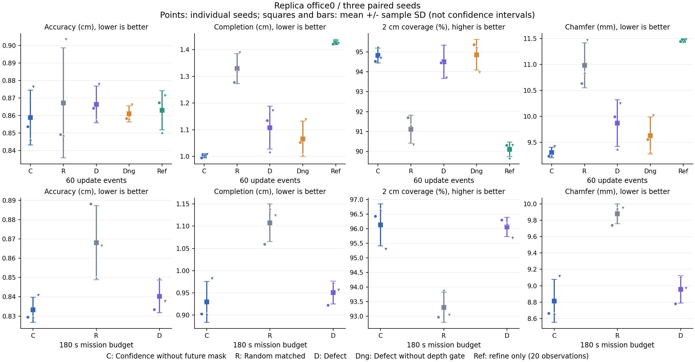

# optimization-v1 完整 GPU 实验与结果

记录日期：2026-10-06。**闭环和公平比较已完成，但第一版几何缺陷评分没有取得稳定质量提升。** 此轮保留预先冻结的权重、阈值、预算和全部种子，未按结果调参、重试或覆盖实验。

已验收 3 个短实验、15 个固定观测分支、9 个时间预算分支，共27条；正式质量统计只用后24条。三阶段按顺序执行，所有相关worker/child已退出，24份正式网页预览已导出。GPU每次准入时物理卡2为16 MiB、0%利用率，符合显存<1024 MiB且利用率≤5%的约定；没有终止他人任务。CUDA/Habitat实际闭环通过，CVD=2、逻辑CUDA卡0；日志没有独立记录EGL物理设备ID，不据此声称额外验证了该ID。

## 结论

固定60次更新下，Defect的Completion与Chamfer在三个种子均比confidence_nooracle更差，规划和墙钟成本也增加。180秒任务预算下，两种子的Completion/Chamfer退化，另一个改善，均值仍更差。因此此轮证明新评分接入成功、确实影响选择和产生可复核结果，**不能宣称质量优化成功**。

移除深度跳变门控后，Completion和Chamfer在三个种子均优于有门控Defect，但仍未达到confidence基线；其覆盖率均值比confidence略高0.040个百分点，不能省略这一局部改善，也不能据此称整体更好。Refine只继续优化20个已有观测，Completion/Chamfer与覆盖率均比Defect更差，说明本次追加观测有价值，不能证明本次缺陷信号优于confidence。

## 协议、来源与验收

执行依据为[冻结框架](../optimization-framework.md)，命令见[受控实验说明](../controlled-experiments.md)。参考网格只用于评估，规划未来观测调用为0，候选未来深度掩码关闭。各分支恢复真实公共前缀、训练帧、相机、体素地图与随机域；同种子前缀与相机hash一致。包含纹理的完整场景输入hash、网格、源版本和评估参数跨两种预算一致。共享已知包围盒作为公开先验。

| 阶段 | 实际目录标识 | 验收 |
| --- | --- | --- |
| 短闭环 | smoke-02bcee2440b54637aec1bf539b6b0d43 | 3/3，6事件/2公共观测 |
| 固定观测 | observations-ae8337e0aca54980b2806f3c2b82aec8 | 5方法×3种子，15/15 |
| 固定时间 | time-1280678ec08c48afbdbdf1e2c5d9e05a | 3方法×3种子，9/9 |

实际重建源提交为 `54b091c5f79478467da4acb3be48227f18c9b27e`；上游ActiveGS为 `558121a00b2eca84d9851a609e99ebb8e26ea2d8`。结果发布提交与实验源提交应区分。正式统计在整链completed及进程退出后，重新检查当前Torch ZIP/存储、PLY几何负载、相机、前缀、阶段、成本和停止原因，并要求fresh汇总与保存的paired-results逐项一致；它不解包执行Torch对象，也不声称逐tensor语义或全局Torch路径姿态已由该标准库审计器验证。独立JSON统计复核与浏览器只读检查也通过。

指标统一为500,000个面积加权表面采样点，Accuracy/Completion为cm，Chamfer从作者的m转成mm，2cm覆盖率为%。下表为三种子的均值±样本标准差（n−1），**不是置信区间**，不作显著性结论。


## 固定 60 次更新：质量

前20次为公共采集前缀；Refine只有20次观测，其余方法60次观测。

| 方法 | Accuracy ↓ cm | Completion ↓ cm | 覆盖率 ↑ % | Chamfer ↓ mm |
| --- | --- | --- | --- | --- |
| Confidence（无候选真值） | 0.859 ± 0.016 | 1.002 ± 0.007 | 94.821 ± 0.377 | 9.304 ± 0.102 |
| Random matched | 0.867 ± 0.031 | 1.329 ± 0.056 | 91.116 ± 0.700 | 10.980 ± 0.431 |
| Defect | 0.866 ± 0.010 | 1.108 ± 0.081 | 94.502 ± 0.830 | 9.871 ± 0.450 |
| Defect no gate | 0.861 ± 0.005 | 1.065 ± 0.067 | 94.861 ± 0.768 | 9.632 ± 0.356 |
| Refine only | 0.863 ± 0.011 | 1.428 ± 0.009 | 90.098 ± 0.368 | 11.456 ± 0.021 |


Defect减同种子confidence的配对差；距离为正表示退化，覆盖率为负表示退化，覆盖率差为百分点。配对差的标准差单独计算。

| 指标 | seed 0 Δ | seed 1 Δ | seed 2 Δ | 配对差均值 ± SD |
| --- | --- | --- | --- | --- |
| accuracy_cm | +0.01049 | +0.01089 | +0.00138 | 0.00759 ± 0.00538 |
| completion_cm | +0.14071 | +0.01310 | +0.16328 | 0.10570 ± 0.08098 |
| coverage_percent | -0.06520 | +0.10620 | -0.99780 | -0.31893 ± 0.59413 |
| chamfer_mm | +0.75602 | +0.11996 | +0.82333 | 0.56644 ± 0.38812 |

## 固定 60 次更新：成本

| 方法 | 任务 s | 重建墙钟 s | 规划 s | 建图 s | 观测数 | 路径 m | Torch峰值 MiB |
| --- | --- | --- | --- | --- | --- | --- | --- |
| Confidence（无候选真值） | 96.14 ± 1.68 | 64.55 ± 0.64 | 22.98 ± 0.40 | 39.46 ± 0.40 | 60.00 ± 0.00 | 33.70 ± 1.16 | 2292.66 ± 104.29 |
| Random matched | 71.08 ± 3.74 | 52.01 ± 0.49 | 10.07 ± 0.48 | 39.89 ± 0.59 | 60.00 ± 0.00 | 21.12 ± 3.30 | 2268.20 ± 112.64 |
| Defect | 101.06 ± 4.88 | 69.25 ± 0.20 | 26.76 ± 0.32 | 40.29 ± 0.17 | 60.00 ± 0.00 | 34.01 ± 4.94 | 2316.93 ± 108.78 |
| Defect no gate | 102.04 ± 4.56 | 68.57 ± 0.31 | 26.23 ± 0.17 | 40.13 ± 0.46 | 60.00 ± 0.00 | 35.68 ± 4.79 | 2264.70 ± 30.49 |
| Refine only | 56.37 ± 2.22 | 44.61 ± 0.62 | 7.30 ± 0.20 | 36.38 ± 0.66 | 20.00 ± 0.00 | 12.69 ± 1.95 | 2149.85 ± 130.89 |

## 180 秒任务预算：质量

规划＋建图＋估算移动累计到180秒，完整事件后停止，观测数可不同。

| 方法 | Accuracy ↓ cm | Completion ↓ cm | 覆盖率 ↑ % | Chamfer ↓ mm |
| --- | --- | --- | --- | --- |
| Confidence（无候选真值） | 0.833 ± 0.007 | 0.929 ± 0.046 | 96.122 ± 0.721 | 8.813 ± 0.262 |
| Random matched | 0.868 ± 0.019 | 1.108 ± 0.042 | 93.298 ± 0.517 | 9.879 ± 0.121 |
| Defect | 0.840 ± 0.008 | 0.951 ± 0.026 | 96.053 ± 0.328 | 8.954 ± 0.167 |


Defect减同种子confidence的配对差；距离为正表示退化，覆盖率为负表示退化，覆盖率差为百分点。配对差的标准差单独计算。

| 指标 | seed 0 Δ | seed 1 Δ | seed 2 Δ | 配对差均值 ± SD |
| --- | --- | --- | --- | --- |
| accuracy_cm | +0.00393 | +0.02022 | -0.00313 | 0.00701 ± 0.01197 |
| completion_cm | +0.01961 | +0.07022 | -0.02617 | 0.02122 ± 0.04822 |
| coverage_percent | -0.12740 | -0.46140 | +0.38020 | -0.06953 ± 0.42377 |
| chamfer_mm | +0.11769 | +0.45219 | -0.14649 | 0.14113 ± 0.30003 |

## 180 秒任务预算：成本

| 方法 | 任务 s | 重建墙钟 s | 规划 s | 建图 s | 观测数 | 路径 m | Torch峰值 MiB |
| --- | --- | --- | --- | --- | --- | --- | --- |
| Confidence（无候选真值） | 180.76 ± 0.66 | 121.17 ± 9.66 | 43.38 ± 3.90 | 74.43 ± 5.61 | 111.67 ± 8.96 | 62.94 ± 10.16 | 3528.74 ± 220.52 |
| Random matched | 180.14 ± 0.12 | 136.78 ± 1.32 | 18.57 ± 1.47 | 113.27 ± 2.58 | 171.33 ± 4.62 | 48.30 ± 1.26 | 5022.02 ± 54.31 |
| Defect | 180.69 ± 0.37 | 117.37 ± 2.07 | 47.29 ± 1.02 | 66.81 ± 1.12 | 100.33 ± 2.08 | 66.59 ± 1.99 | 3238.19 ± 67.09 |

## 成本解释与消融

固定观测下，Defect平均规划耗时比confidence高16.44%，重建墙钟高7.28%；排除公共前缀后的规划耗时高24.09%。固定时间下，规划耗时高9.03%，平均观测从111.667减到100.333（−10.15%）。其重建墙钟和Torch峰值较低伴随更少观测，**不能称为同质量加速或等负载显存优化**。

任务时间为同步规划＋建图＋估算移动，完整事件跨过180秒后停止，因此末值可略大于180。传感器采集、诊断IO单列，重建墙钟另记；网格/评估和导出不包含在任务或重建墙钟中，完整流水线耗时亦不同。记录中的Torch峰值不包括Habitat/OpenGL，不是最低显存需求。所有逐分支成本、后缀成本和网格评估耗时保存在[公开快照](evidence/optimization-v1-summary.json)。

深度门控消融只在固定观测协议执行；没有选择性补跑时间消融。移除门控改善Completion/Chamfer提示当前门控可能抑制有用信号，但尚未隔离因果机制。仅继续优化的控制为20观测、60事件、600优化步，不含40次新采集。

## 几何信号是否实际生效

信号有效面积与法线残差是当前地图代理，不等同于真实场景误差。统计只含公共前缀后的规划事件；Refine后缀没有规划，不把它的激活率写成测得的零。


| 协议 | 方法 | 几何项激活/测量 | 弱信号回退事件 | 稳健λ=0反事实改选/可比较 | 近并列事件 |
| --- | --- | --- | --- | --- | --- |
| 固定 60 次更新 | Defect | 120/120 | 0 | 78/120 | 0 |
| 固定 60 次更新 | Defect no gate | 120/120 | 0 | 72/120 | 0 |
| 180 秒任务预算 | Defect | 241/241 | 0 | 164/240 | 1 |


Defect固定观测激活120/120、稳健改选78/120（65.0%）；固定时间激活241/241，排除1个近并列后稳健改选164/240（68.33%）。它没有因全程弱信号而静默退回baseline。反事实仅使用同一条日志中的候选组，纯Python重算实数评分，容差10⁻⁶，基准首两名差必须>2×10⁻⁶；随机全零回退不回放。这不是λ=0的完整重建实验。分支地图分叉后，不能说各方法每一步拥有相同候选位姿。

短闭环的4个Defect后缀事件全部激活，其中2个改选；第一次分叉与confidence的候选位姿、基础分数、路径一致。这是功能证据，未纳入正式质量表。

## 逐种子原始结果


### 固定 60 次更新

| 方法 | 种子 | 观测 | 事件 | Accuracy cm | Completion cm | 覆盖率 % | Chamfer mm |
| --- | --- | --- | --- | --- | --- | --- | --- |
| Confidence（无候选真值） | 0 | 60 | 60 | 0.853769 | 0.994126 | 94.525800 | 9.239475 |
| Confidence（无候选真值） | 1 | 60 | 60 | 0.846336 | 1.003863 | 95.245000 | 9.250995 |
| Confidence（无候选真值） | 2 | 60 | 60 | 0.876459 | 1.007920 | 94.691200 | 9.421892 |
| Random matched | 0 | 60 | 60 | 0.849309 | 1.277976 | 91.696800 | 10.636428 |
| Random matched | 1 | 60 | 60 | 0.848943 | 1.319136 | 91.313000 | 10.840393 |
| Random matched | 2 | 60 | 60 | 0.903532 | 1.389325 | 90.338200 | 11.464284 |
| Defect | 0 | 60 | 60 | 0.864263 | 1.134835 | 94.460600 | 9.995492 |
| Defect | 1 | 60 | 60 | 0.857227 | 1.016965 | 95.351200 | 9.370958 |
| Defect | 2 | 60 | 60 | 0.877843 | 1.171201 | 93.693400 | 10.245223 |
| Defect no gate | 0 | 60 | 60 | 0.858383 | 1.052525 | 95.360200 | 9.554539 |
| Defect no gate | 1 | 60 | 60 | 0.858388 | 1.005755 | 95.245400 | 9.320710 |
| Defect no gate | 2 | 60 | 60 | 0.866279 | 1.137629 | 93.976000 | 10.019539 |
| Refine only | 0 | 20 | 60 | 0.867318 | 1.421154 | 90.314800 | 11.442358 |
| Refine only | 1 | 20 | 60 | 0.850399 | 1.438395 | 89.672800 | 11.443968 |
| Refine only | 2 | 20 | 60 | 0.871376 | 1.424673 | 90.306200 | 11.480246 |

### 180 秒任务预算

| 方法 | 种子 | 观测 | 事件 | Accuracy cm | Completion cm | 覆盖率 % | Chamfer mm |
| --- | --- | --- | --- | --- | --- | --- | --- |
| Confidence（无候选真值） | 0 | 107 | 107 | 0.829468 | 0.902975 | 96.426000 | 8.662216 |
| Confidence（无候选真值） | 1 | 106 | 106 | 0.829437 | 0.902806 | 96.641000 | 8.661213 |
| Confidence（无候选真值） | 2 | 122 | 122 | 0.840798 | 0.982447 | 95.299400 | 9.116223 |
| Random matched | 0 | 166 | 166 | 0.888172 | 1.059701 | 92.965400 | 9.739367 |
| Random matched | 1 | 174 | 174 | 0.849840 | 1.139312 | 93.894200 | 9.945761 |
| Random matched | 2 | 174 | 174 | 0.866347 | 1.123927 | 93.035000 | 9.951370 |
| Defect | 0 | 98 | 98 | 0.833398 | 0.922584 | 96.298600 | 8.779909 |
| Defect | 1 | 102 | 102 | 0.849654 | 0.973027 | 96.179600 | 9.113402 |
| Defect | 2 | 101 | 101 | 0.837672 | 0.956275 | 95.679600 | 8.969735 |

## 可视化与复核



每个点为一个种子，方块与误差线为均值±样本标准差；C=Confidence，R=Random matched，D=Defect，Dng=Defect no gate，Ref=Refine only。两预算单独绘制，不将单次原作者结果混为基线。

浏览器支持24份正式结果的真实网格、相机、轨迹、时间/事件检查点、缺陷热图与协议配对；新增历史汇总独立于当前运行状态，明确均值、标准差、配对差和局限。固定观测三Defect种子及Refine显示、时间协议9份导出均已GET-only实测；桌面与390px手机无横向溢出，零POST、零页面异常。仅有原始文件的真实诊断才显示热图。时间最终观测：Confidence 107/106/122，Random 166/174/174，Defect 98/102/101；不能误标为60。

按以下命令重新审计（仅CPU、标准库；读取自己可信的服务器产物，输出需是新路径，不会自动覆盖）：

```bash
cd /workspace/ViewMend3D
/opt/conda/bin/python scripts/activegs/analyze_campaign.py \
  --root "$PWD" --output "$PWD/runs/campaigns/optimization-v1/reanalysis.json"
```

全链未完成、活worker/child、方法/种子/配置不完整、资产hash不一致、文件或配对汇总不一致时拒绝输出。完整逐事件分析保留在服务器setup；公开小型快照保留24条质量/成本、各方法统计、配对差、消融、诊断分布和来源指纹。[验收与只读界面证据](evidence/optimization-v1-verification.json)记录完整阶段、独立数值核对和真实浏览器检查。原始地图、RGB-D、数据集和密钥不进入Git。

静态图可用已安装Matplotlib的CPU环境复现：

```bash
CUDA_VISIBLE_DEVICES='' .envs/activegs/bin/python scripts/activegs/plot_campaign.py \
  docs/reproduction/evidence/optimization-v1-summary.json \
  --output runs/optimization-v1-quality.png
```

## 局限与下一轮方向

结果仅来自office0、三个固定种子，不能证明显著性或跨场景泛化。原作者oracle配置、300秒单次结果与本轮预算及信息边界不同，单独保留。当前残差既可能来自不足观测，也可能来自合法曲面、遮挡和Gaussian表示；本轮未测得它与真实局部误差/新增信息收益的相关性。

下一轮首先做不占GPU的诊断：核对残差分布和门控覆盖，结合已有选视角记录找出高残差却无收益的案例，分开几何代理信号与当前未探索效用；将规划开销单独归因。先另立v2协议，固定候选选择规则和参数网格，再考虑较弱/自适应几何权重与边缘抑制。保留本轮负结果，不静默替换v1参数。多场景验证须另选验证与测试场景，不能在office0反复选参后声称泛化。这些是后续研究方向，本轮未执行。

课程已有三维数据、真实闭环、源码/入口、测试样例、功能展示、对照消融与报告素材；队员姓名和真实分工、课程截止日期仍由团队补充。新GPU型号/系统上的安装和网页POST启动全链未独立实测，不把CLI campaign成功当作已测过所有部署入口。


公开来源：场景完整资产 SHA256 `39952360dfbf16321e7649f6572d514fc40e3dd2e49af7c4cb7834ae890fee66`，网格 SHA256 `cdb6ede0b9d455f491ef8fd63cd916a86a505b777842aabd6aa428edf9ff9032`；完整分析 SHA256 `6c4fbce35906340cabbee12226bf773df105230d16bc05fe3c133e51c02f0639`，分析脚本 SHA256 `131349cef9b30460fa0557a230653e5a2df6cf3ad6a1d0929ee8799499162c23`。CPU与独立数值检查的范围见相应证据记录。
