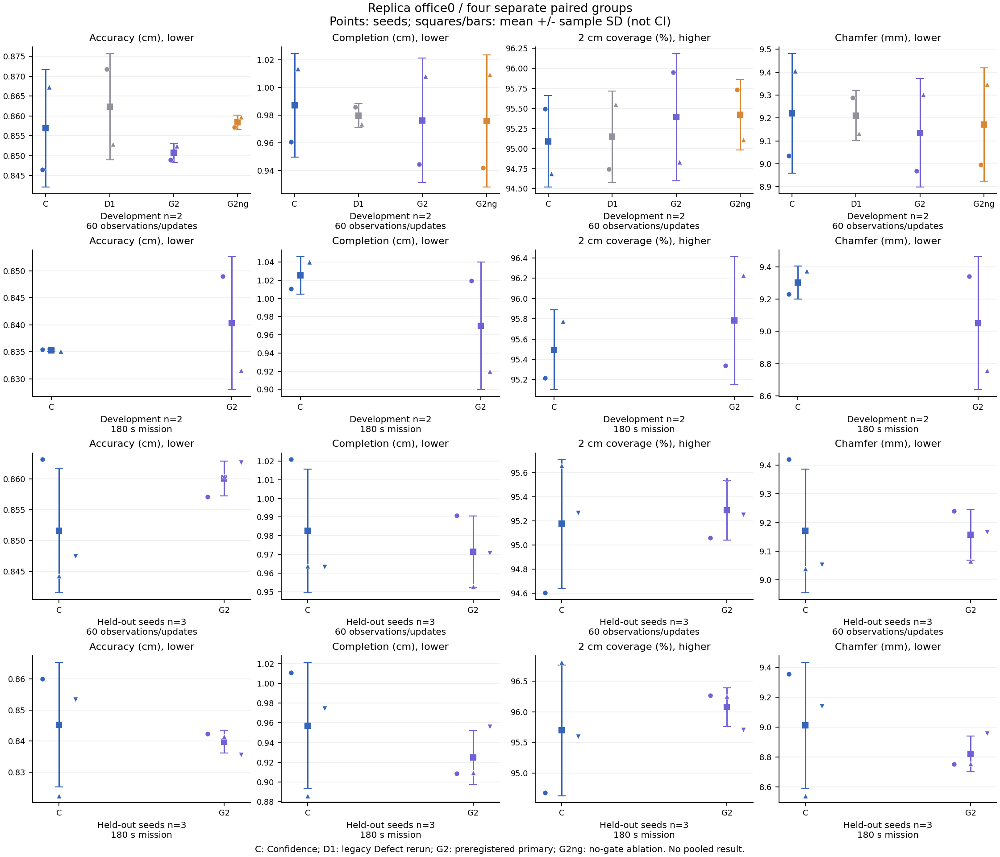
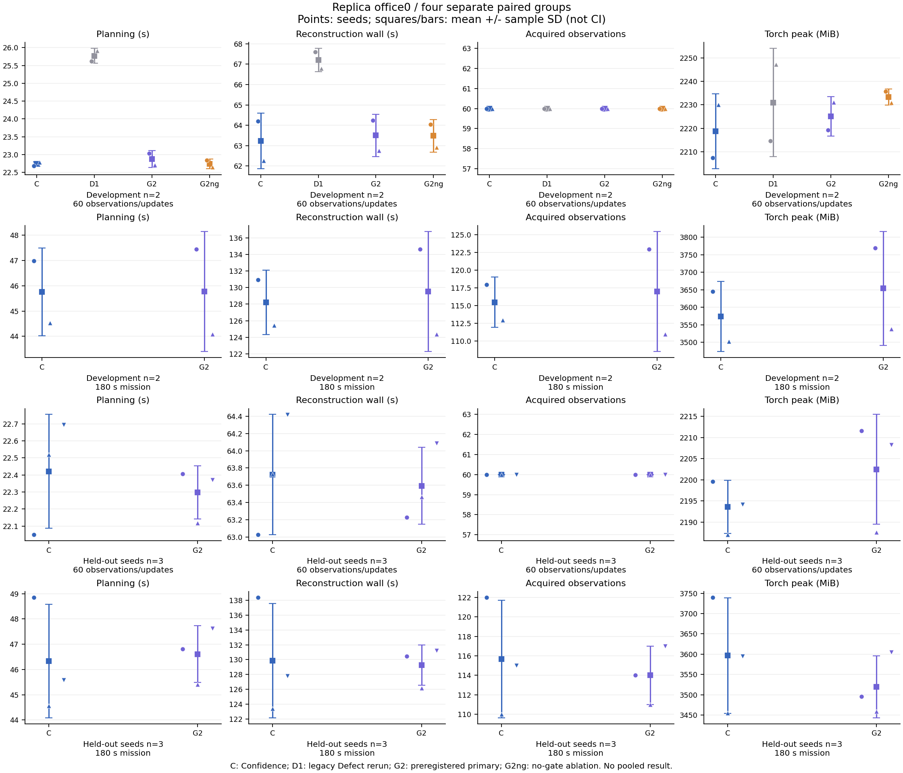

# optimization-v2 完整 GPU 实验与结果

最终分析时间：2026-10-06T08:58:02.075386+00:00。五阶段27分支完成并通过 fresh 审计；其中24条用于正式质量统计。
主方法按预注册固定为 **Guarded v2（defect_guarded）**。不按开发消融结果改换主方法；以下只报告实际差异，不作显著性或跨场景泛化结论。

**本轮有局部平均改善，尚不能认定稳定、可归因的质量提升。** 留出固定观测的平均 Completion 从 0.982583 cm 降到 0.971433 cm（约 1.1%），平均覆盖率增加 0.111467 个百分点，但只有种子 3 的覆盖率改善，种子 4/5 下降，Accuracy 均值退化。留出时间预算的平均 Completion 从 0.957186 cm 降到 0.924713 cm（约 3.4%），覆盖率增加 0.380533 个百分点；种子 4 的四项质量指标全部退化。所有种子与成本均保留。

主方法相对 Confidence 的平均规划成本在四组分别变化约 +0.604%、+0.036%、−0.549%、+0.600%。留出时间预算的墙钟均值减少约 0.457%，同时平均观测从 115.667 次变为 114 次，不能称为等负载加速。独立分支的地图与轨迹还存在下述可重复性边界，因此不把质量差异全部归因于几何奖励。





两图各行是独立组，不合并开发/留出或预算。点分别为种子；开发圆点/上三角是 0/1，留出圆点/上三角/下三角是 3/4/5。方块与误差线为均值±样本 SD；C 为 Confidence，D1 为本轮重跑的旧 Defect，G2 为固定主方法，G2ng 为开发消融。

## 协议与解释

四个正式阶段独立展示。开发种子0/1（n=2）与留出种子3/4/5（n=3）不合并；观测预算与时间预算也不合并。均值±样本标准差采用 n−1，既不是置信区间，也不是显著性检验。
Accuracy/Completion 已是 cm，Chamfer 已是 mm，覆盖率已是 %，不再次换算。配对差一律同 seed 方法减 Confidence；距离负值、覆盖率正值方向更好，覆盖率差用百分点 pp。
所有质量值来自相同评估配置。公共前缀真实地图、采集与 RNG 按 seed 配对；候选未来观测与掩码关闭，参考网格只用于评估，公开场景包围盒为共同先验。

## 固定主方法的描述性结果

- 开发种子 · 固定 60 次观测/更新（n=2）：Accuracy ↓ Δ -0.00616 cm；Completion ↓ Δ -0.01078 cm；2 cm 覆盖率 ↑ Δ +0.30180 pp；Chamfer ↓ Δ -0.08472 mm。Completion 更低 2/2 个 seed，覆盖率更高 2/2 个 seed。
- 开发种子 · 180 秒任务预算（n=2）：Accuracy ↓ Δ +0.00501 cm；Completion ↓ Δ -0.05553 cm；2 cm 覆盖率 ↑ Δ +0.28850 pp；Chamfer ↓ Δ -0.25260 mm。Completion 更低 1/2 个 seed，覆盖率更高 2/2 个 seed。
- 留出种子 · 固定 60 次观测/更新（n=3）：Accuracy ↓ Δ +0.00842 cm；Completion ↓ Δ -0.01115 cm；2 cm 覆盖率 ↑ Δ +0.11147 pp；Chamfer ↓ Δ -0.01366 mm。Completion 更低 2/3 个 seed，覆盖率更高 1/3 个 seed。
- 留出种子 · 180 秒任务预算（n=3）：Accuracy ↓ Δ -0.00546 cm；Completion ↓ Δ -0.03247 cm；2 cm 覆盖率 ↑ Δ +0.38053 pp；Chamfer ↓ Δ -0.18965 mm。Completion 更低 2/3 个 seed，覆盖率更高 2/3 个 seed。

即使部分指标均值方向有利，也需同时查看每个 seed、其他质量指标与采集/耗时权衡；低基线代理 regret 不是重建质量保证。

## 开发种子 · 固定 60 次观测/更新

实际批次：`development_observations-2f5d7f6c28cf42cf91760da60d1cdb13`；种子 [0, 1]，n=2。前20次采集为同 seed 的公共前缀。

所有方法最终60次观测与60次更新；消融只在开发观测阶段执行。

### 质量均值与样本 SD

| 方法 | Accuracy ↓ / cm | Completion ↓ / cm | 2 cm 覆盖率 ↑ / % | Chamfer ↓ / mm |
| --- | --- | --- | --- | --- |
| Confidence（无候选真值） | 0.857 ± 0.015 | 0.987 ± 0.037 | 95.089 ± 0.569 | 9.220 ± 0.261 |
| Defect v1（本轮开发对照） | 0.862 ± 0.013 | 0.980 ± 0.009 | 95.146 ± 0.570 | 9.210 ± 0.110 |
| Guarded v2（固定主方法） | 0.851 ± 0.002 | 0.976 ± 0.045 | 95.391 ± 0.792 | 9.135 ± 0.237 |
| Guarded v2 no gate（消融） | 0.858 ± 0.002 | 0.976 ± 0.048 | 95.421 ± 0.442 | 9.171 ± 0.247 |

### 逐种子质量

| 方法 | seed | 观测 | 事件 | Accuracy ↓ / cm | Completion ↓ / cm | 2 cm 覆盖率 ↑ / % | Chamfer ↓ / mm |
| --- | --- | --- | --- | --- | --- | --- | --- |
| Confidence（无候选真值） | 0 | 60 | 60 | 0.846450 | 0.960640 | 95.491800 | 9.035448 |
| Confidence（无候选真值） | 1 | 60 | 60 | 0.867305 | 1.013530 | 94.686800 | 9.404177 |
| Defect v1（本轮开发对照） | 0 | 60 | 60 | 0.871744 | 0.985782 | 94.742800 | 9.287633 |
| Defect v1（本轮开发对照） | 1 | 60 | 60 | 0.852913 | 0.973592 | 95.549400 | 9.132526 |
| Guarded v2（固定主方法） | 0 | 60 | 60 | 0.849017 | 0.944552 | 95.950800 | 8.967846 |
| Guarded v2（固定主方法） | 1 | 60 | 60 | 0.852410 | 1.008057 | 94.831400 | 9.302335 |
| Guarded v2 no gate（消融） | 0 | 60 | 60 | 0.857152 | 0.942139 | 95.734000 | 8.996452 |
| Guarded v2 no gate（消融） | 1 | 60 | 60 | 0.859690 | 1.009555 | 95.108600 | 9.346226 |

### 同 seed 配对差（方法 − Confidence）

距离差为 cm/mm；覆盖率差为 pp。配对差的样本 SD 单独计算。

**Defect v1（本轮开发对照）**

| 指标 | seed 0 Δ | seed 1 Δ | 配对差均值 ± SD |
| --- | --- | --- | --- |
| accuracy_cm | +0.02529 | -0.01439 | +0.00545 ± 0.02806 |
| completion_cm | +0.02514 | -0.03994 | -0.00740 ± 0.04602 |
| coverage_percent / pp | -0.74900 | +0.86260 | +0.05680 ± 1.13957 |
| chamfer_mm | +0.25218 | -0.27165 | -0.00973 ± 0.37041 |

**Guarded v2（固定主方法）**

| 指标 | seed 0 Δ | seed 1 Δ | 配对差均值 ± SD |
| --- | --- | --- | --- |
| accuracy_cm | +0.00257 | -0.01490 | -0.00616 ± 0.01235 |
| completion_cm | -0.01609 | -0.00547 | -0.01078 ± 0.00751 |
| coverage_percent / pp | +0.45900 | +0.14460 | +0.30180 ± 0.22231 |
| chamfer_mm | -0.06760 | -0.10184 | -0.08472 ± 0.02421 |

**Guarded v2 no gate（消融）**

| 指标 | seed 0 Δ | seed 1 Δ | 配对差均值 ± SD |
| --- | --- | --- | --- |
| accuracy_cm | +0.01070 | -0.00762 | +0.00154 ± 0.01295 |
| completion_cm | -0.01850 | -0.00397 | -0.01124 ± 0.01027 |
| coverage_percent / pp | +0.24220 | +0.42180 | +0.33200 ± 0.12700 |
| chamfer_mm | -0.03900 | -0.05795 | -0.04847 ± 0.01340 |

### 成本均值与样本 SD

| 方法 | 任务 / s | 重建墙钟 / s | 规划 / s | 建图 / s | 传感器 / s | 诊断 IO / s | 估算移动 / s |
| --- | --- | --- | --- | --- | --- | --- | --- |
| Confidence（无候选真值） | 89.87 ± 1.85 | 63.23 ± 1.36 | 22.73 ± 0.07 | 38.51 ± 1.29 | 1.26 ± 0.11 | 0.21 ± 0.01 | 28.63 ± 0.63 |
| Defect v1（本轮开发对照） | 97.47 ± 4.27 | 67.20 ± 0.57 | 25.77 ± 0.21 | 39.39 ± 0.68 | 1.23 ± 0.09 | 0.29 ± 0.00 | 32.32 ± 4.74 |
| Guarded v2（固定主方法） | 91.85 ± 3.96 | 63.50 ± 1.04 | 22.87 ± 0.24 | 38.61 ± 0.70 | 1.23 ± 0.05 | 0.28 ± 0.01 | 30.37 ± 3.02 |
| Guarded v2 no gate（消融） | 95.65 ± 6.68 | 63.48 ± 0.80 | 22.74 ± 0.14 | 38.70 ± 0.58 | 1.22 ± 0.06 | 0.28 ± 0.01 | 34.21 ± 5.97 |

| 方法 | 路径 / m | 观测数 | 事件数 | 优化步数 | 前缀后优化步数 | Torch 峰值 / MiB | 网格与评估 / s |
| --- | --- | --- | --- | --- | --- | --- | --- |
| Confidence（无候选真值） | 28.63 ± 0.63 | 60.00 ± 0.00 | 60.00 ± 0.00 | 600.00 ± 0.00 | 400.00 ± 0.00 | 2218.72 ± 15.90 | 16.74 ± 0.17 |
| Defect v1（本轮开发对照） | 32.32 ± 4.74 | 60.00 ± 0.00 | 60.00 ± 0.00 | 600.00 ± 0.00 | 400.00 ± 0.00 | 2230.97 ± 23.01 | 16.88 ± 0.25 |
| Guarded v2（固定主方法） | 30.37 ± 3.02 | 60.00 ± 0.00 | 60.00 ± 0.00 | 600.00 ± 0.00 | 400.00 ± 0.00 | 2225.09 ± 8.37 | 18.25 ± 1.77 |
| Guarded v2 no gate（消融） | 34.21 ± 5.97 | 60.00 ± 0.00 | 60.00 ± 0.00 | 600.00 ± 0.00 | 400.00 ± 0.00 | 2233.30 ± 3.42 | 17.22 ± 0.29 |

### 逐种子成本

| 方法 | seed | 任务 / s | 重建墙钟 / s | 规划 / s | 建图 / s | 传感器 / s | 诊断 IO / s | 估算移动 / s |
| --- | --- | --- | --- | --- | --- | --- | --- | --- |
| Confidence（无候选真值） | 0 | 91.180 | 64.200 | 22.686 | 39.425 | 1.332 | 0.218 | 29.069 |
| Confidence（无候选真值） | 1 | 88.566 | 62.270 | 22.778 | 37.604 | 1.184 | 0.197 | 28.183 |
| Defect v1（本轮开发对照） | 0 | 94.455 | 67.604 | 25.623 | 39.870 | 1.298 | 0.294 | 28.963 |
| Defect v1（本轮开发对照） | 1 | 100.490 | 66.793 | 25.919 | 38.903 | 1.172 | 0.288 | 35.669 |
| Guarded v2（固定主方法） | 0 | 94.646 | 64.235 | 23.037 | 39.104 | 1.263 | 0.294 | 32.505 |
| Guarded v2（固定主方法） | 1 | 89.044 | 62.762 | 22.702 | 38.110 | 1.187 | 0.273 | 28.231 |
| Guarded v2 no gate（消融） | 0 | 100.373 | 64.047 | 22.835 | 39.111 | 1.262 | 0.293 | 38.427 |
| Guarded v2 no gate（消融） | 1 | 90.927 | 62.914 | 22.643 | 38.296 | 1.180 | 0.275 | 29.988 |

| 方法 | seed | 路径 / m | 观测数 | 事件数 | 优化步数 | 前缀后优化步数 | Torch 峰值 / MiB | 网格与评估 / s |
| --- | --- | --- | --- | --- | --- | --- | --- | --- |
| Confidence（无候选真值） | 0 | 29.069 | 60.000 | 60.000 | 600.000 | 400.000 | 2207.477 | 16.618 |
| Confidence（无候选真值） | 1 | 28.183 | 60.000 | 60.000 | 600.000 | 400.000 | 2229.959 | 16.856 |
| Defect v1（本轮开发对照） | 0 | 28.963 | 60.000 | 60.000 | 600.000 | 400.000 | 2214.702 | 17.054 |
| Defect v1（本轮开发对照） | 1 | 35.669 | 60.000 | 60.000 | 600.000 | 400.000 | 2247.242 | 16.702 |
| Guarded v2（固定主方法） | 0 | 32.505 | 60.000 | 60.000 | 600.000 | 400.000 | 2219.172 | 19.501 |
| Guarded v2（固定主方法） | 1 | 28.231 | 60.000 | 60.000 | 600.000 | 400.000 | 2231.015 | 16.994 |
| Guarded v2 no gate（消融） | 0 | 38.427 | 60.000 | 60.000 | 600.000 | 400.000 | 2235.715 | 17.423 |
| Guarded v2 no gate（消融） | 1 | 29.988 | 60.000 | 60.000 | 600.000 | 400.000 | 2230.885 | 17.015 |

### 前缀后成本及配对差

以下不包含公共前缀；逐事件诊断 IO 的完整计时使用 run-summary 字段。

| 方法 | planning_seconds | mapping_seconds | sensor_seconds | diagnostic_seconds | events | observations |
| --- | --- | --- | --- | --- | --- | --- |
| Confidence（无候选真值） | 15.690 ± 0.071 | 27.143 ± 0.862 | 0.833 ± 0.063 | 0.141 ± 0.010 | 40.000 ± 0.000 | 40.000 ± 0.000 |
| Defect v1（本轮开发对照） | 18.729 ± 0.215 | 28.015 ± 0.258 | 0.810 ± 0.047 | 0.224 ± 0.000 | 40.000 ± 0.000 | 40.000 ± 0.000 |
| Guarded v2（固定主方法） | 15.828 ± 0.231 | 27.236 ± 0.277 | 0.800 ± 0.012 | 0.216 ± 0.010 | 40.000 ± 0.000 | 40.000 ± 0.000 |
| Guarded v2 no gate（消融） | 15.697 ± 0.130 | 27.332 ± 0.151 | 0.796 ± 0.016 | 0.217 ± 0.008 | 40.000 ± 0.000 | 40.000 ± 0.000 |

**Defect v1（本轮开发对照）的成本配对差**（方法 − Confidence）

| 成本指标 | seed 0 Δ | seed 1 Δ | 配对差均值 ± SD |
| --- | --- | --- | --- |
| 任务 / s | +3.275 | +11.925 | +7.600 ± 6.116 |
| 重建墙钟 / s | +3.404 | +4.523 | +3.964 ± 0.792 |
| 规划 / s | +2.937 | +3.140 | +3.039 ± 0.143 |
| 建图 / s | +0.445 | +1.298 | +0.872 ± 0.604 |
| 传感器 / s | -0.035 | -0.012 | -0.023 ± 0.016 |
| 诊断 IO / s | +0.076 | +0.091 | +0.083 ± 0.010 |
| 估算移动 / s | -0.107 | +7.486 | +3.690 ± 5.369 |
| 路径 / m | -0.107 | +7.486 | +3.690 ± 5.369 |
| 观测数 | +0.000 | +0.000 | +0.000 ± 0.000 |
| 事件数 | +0.000 | +0.000 | +0.000 ± 0.000 |
| 优化步数 | +0.000 | +0.000 | +0.000 ± 0.000 |
| 前缀后优化步数 | +0.000 | +0.000 | +0.000 ± 0.000 |
| Torch 峰值 / MiB | +7.226 | +17.283 | +12.254 ± 7.111 |
| 网格与评估 / s | +0.436 | -0.154 | +0.141 ± 0.417 |

**Guarded v2（固定主方法）的成本配对差**（方法 − Confidence）

| 成本指标 | seed 0 Δ | seed 1 Δ | 配对差均值 ± SD |
| --- | --- | --- | --- |
| 任务 / s | +3.466 | +0.478 | +1.972 ± 2.113 |
| 重建墙钟 / s | +0.035 | +0.492 | +0.263 ± 0.323 |
| 规划 / s | +0.351 | -0.076 | +0.137 ± 0.302 |
| 建图 / s | -0.321 | +0.506 | +0.093 ± 0.585 |
| 传感器 / s | -0.069 | +0.004 | -0.033 ± 0.051 |
| 诊断 IO / s | +0.076 | +0.076 | +0.076 ± 0.000 |
| 估算移动 / s | +3.436 | +0.048 | +1.742 ± 2.395 |
| 路径 / m | +3.436 | +0.048 | +1.742 ± 2.395 |
| 观测数 | +0.000 | +0.000 | +0.000 ± 0.000 |
| 事件数 | +0.000 | +0.000 | +0.000 ± 0.000 |
| 优化步数 | +0.000 | +0.000 | +0.000 ± 0.000 |
| 前缀后优化步数 | +0.000 | +0.000 | +0.000 ± 0.000 |
| Torch 峰值 / MiB | +11.696 | +1.056 | +6.376 ± 7.523 |
| 网格与评估 / s | +2.884 | +0.138 | +1.511 ± 1.941 |

**Guarded v2 no gate（消融）的成本配对差**（方法 − Confidence）

| 成本指标 | seed 0 Δ | seed 1 Δ | 配对差均值 ± SD |
| --- | --- | --- | --- |
| 任务 / s | +9.193 | +2.361 | +5.777 ± 4.831 |
| 重建墙钟 / s | -0.152 | +0.645 | +0.246 ± 0.564 |
| 规划 / s | +0.149 | -0.135 | +0.007 ± 0.201 |
| 建图 / s | -0.314 | +0.692 | +0.189 ± 0.711 |
| 传感器 / s | -0.070 | -0.004 | -0.037 ± 0.047 |
| 诊断 IO / s | +0.075 | +0.078 | +0.077 ± 0.002 |
| 估算移动 / s | +9.358 | +1.805 | +5.581 ± 5.340 |
| 路径 / m | +9.358 | +1.805 | +5.581 ± 5.340 |
| 观测数 | +0.000 | +0.000 | +0.000 ± 0.000 |
| 事件数 | +0.000 | +0.000 | +0.000 ± 0.000 |
| 优化步数 | +0.000 | +0.000 | +0.000 ± 0.000 |
| 前缀后优化步数 | +0.000 | +0.000 | +0.000 ± 0.000 |
| Torch 峰值 / MiB | +28.239 | +0.926 | +14.583 ± 19.313 |
| 网格与评估 / s | +0.806 | +0.159 | +0.482 ± 0.457 |

### 当前地图信号、奖励与改选

诊断只统计各分支前缀后的实际候选组。selection_changed 比较该方法自身当前地图上同一次候选集的 S0 首选与 S2 首选，不是与独立 Confidence 分支的实际轨迹逐事件比较。各方法改选后地图与候选可能不同。事件加权均值不等于 seed 均值；它只描述评分行为，不是质量样本数。

**Guarded v2（固定主方法）**：测得 80 个事件，信号有效 80，实际奖励应用 80，相对同次候选集、同一当前地图上的 S0 首选改选 2。
事件加权平均 baseline-score regret=0.00000，最大值=0.00010；奖励上限范围=[0.001, 0.001]，最大 regret/cap=0.10464（实现允许记录的浮点容差）。

| 回退原因 | 事件数 |
| --- | --- |
| β=0 | 0 |
| 基础效用全零 | 0 |
| 仅一个可达候选 | 0 |
| 几何信号不足 | 0 |
| 几何项恒定 | 0 |

**Guarded v2 no gate（消融）**：测得 80 个事件，信号有效 80，实际奖励应用 80，相对同次候选集、同一当前地图上的 S0 首选改选 2。
事件加权平均 baseline-score regret=0.00001，最大值=0.00075；奖励上限范围=[0.001, 0.001]，最大 regret/cap=0.74521（实现允许记录的浮点容差）。

| 回退原因 | 事件数 |
| --- | --- |
| β=0 | 0 |
| 基础效用全零 | 0 |
| 仅一个可达候选 | 0 |
| 几何信号不足 | 0 |
| 几何项恒定 | 0 |

逐 seed 的奖励应用、同次候选集 S0→S2 改选与 regret：

| 方法 | seed | 诊断事件 | 奖励应用 | 同次候选集 S0→S2 改选 | 平均 regret | 最大 regret | utility s |
| --- | --- | --- | --- | --- | --- | --- | --- |
| Guarded v2（固定主方法） | 0 | 40 | 40 | 2 | 0.00000 | 0.00010 | 12.827 |
| Guarded v2（固定主方法） | 1 | 40 | 40 | 0 | 0.00000 | 0.00000 | 12.547 |
| Guarded v2 no gate（消融） | 0 | 40 | 40 | 1 | 0.00002 | 0.00075 | 12.816 |
| Guarded v2 no gate（消融） | 1 | 40 | 40 | 1 | 0.00000 | 0.00011 | 12.631 |

## 开发种子 · 180 秒任务预算

实际批次：`development_time-58409d98010142c594f4ddc4edef0669`；种子 [0, 1]，n=2。前20次采集为同 seed 的公共前缀。

时间协议累积同步规划＋建图＋估算移动，完整事件跨过180秒后才停止，最终观测数可不同。

### 质量均值与样本 SD

| 方法 | Accuracy ↓ / cm | Completion ↓ / cm | 2 cm 覆盖率 ↑ / % | Chamfer ↓ / mm |
| --- | --- | --- | --- | --- |
| Confidence（无候选真值） | 0.835 ± 0.000 | 1.025 ± 0.021 | 95.495 ± 0.396 | 9.303 ± 0.103 |
| Guarded v2（固定主方法） | 0.840 ± 0.012 | 0.970 ± 0.070 | 95.783 ± 0.630 | 9.050 ± 0.413 |

### 逐种子质量

| 方法 | seed | 观测 | 事件 | Accuracy ↓ / cm | Completion ↓ / cm | 2 cm 覆盖率 ↑ / % | Chamfer ↓ / mm |
| --- | --- | --- | --- | --- | --- | --- | --- |
| Confidence（无候选真值） | 0 | 118 | 118 | 0.835461 | 1.010648 | 95.214600 | 9.230543 |
| Confidence（无候选真值） | 1 | 113 | 113 | 0.835126 | 1.039977 | 95.774600 | 9.375516 |
| Guarded v2（固定主方法） | 0 | 123 | 123 | 0.849013 | 1.019490 | 95.337600 | 9.342518 |
| Guarded v2（固定主方法） | 1 | 111 | 111 | 0.831597 | 0.920072 | 96.228600 | 8.758343 |

### 同 seed 配对差（方法 − Confidence）

距离差为 cm/mm；覆盖率差为 pp。配对差的样本 SD 单独计算。

**Guarded v2（固定主方法）**

| 指标 | seed 0 Δ | seed 1 Δ | 配对差均值 ± SD |
| --- | --- | --- | --- |
| accuracy_cm | +0.01355 | -0.00353 | +0.00501 ± 0.01208 |
| completion_cm | +0.00884 | -0.11991 | -0.05553 ± 0.09104 |
| coverage_percent / pp | +0.12300 | +0.45400 | +0.28850 ± 0.23405 |
| chamfer_mm | +0.11198 | -0.61717 | -0.25260 ± 0.51559 |

### 成本均值与样本 SD

| 方法 | 任务 / s | 重建墙钟 / s | 规划 / s | 建图 / s | 传感器 / s | 诊断 IO / s | 估算移动 / s |
| --- | --- | --- | --- | --- | --- | --- | --- |
| Confidence（无候选真值） | 180.70 ± 0.47 | 128.20 ± 3.89 | 45.75 ± 1.74 | 78.77 ± 2.03 | 2.36 ± 0.11 | 0.39 ± 0.02 | 56.17 ± 3.29 |
| Guarded v2（固定主方法） | 180.25 ± 0.13 | 129.52 ± 7.26 | 45.77 ± 2.37 | 79.93 ± 4.72 | 2.34 ± 0.16 | 0.55 ± 0.03 | 54.55 ± 6.96 |

| 方法 | 路径 / m | 观测数 | 事件数 | 优化步数 | 前缀后优化步数 | Torch 峰值 / MiB | 网格与评估 / s |
| --- | --- | --- | --- | --- | --- | --- | --- |
| Confidence（无候选真值） | 56.17 ± 3.29 | 115.50 ± 3.54 | 115.50 ± 3.54 | 1155.00 ± 35.36 | 955.00 ± 35.36 | 3573.97 ± 100.42 | 24.96 ± 0.65 |
| Guarded v2（固定主方法） | 54.55 ± 6.96 | 117.00 ± 8.49 | 117.00 ± 8.49 | 1170.00 ± 84.85 | 970.00 ± 84.85 | 3653.88 ± 162.74 | 25.92 ± 1.18 |

### 逐种子成本

| 方法 | seed | 任务 / s | 重建墙钟 / s | 规划 / s | 建图 / s | 传感器 / s | 诊断 IO / s | 估算移动 / s |
| --- | --- | --- | --- | --- | --- | --- | --- | --- |
| Confidence（无候选真值） | 0 | 181.032 | 130.951 | 46.983 | 80.201 | 2.440 | 0.407 | 53.848 |
| Confidence（无候选真值） | 1 | 180.361 | 125.455 | 44.527 | 77.333 | 2.278 | 0.374 | 58.502 |
| Guarded v2（固定主方法） | 0 | 180.342 | 134.649 | 47.450 | 83.260 | 2.451 | 0.578 | 49.632 |
| Guarded v2（固定主方法） | 1 | 180.158 | 124.385 | 44.092 | 76.591 | 2.221 | 0.532 | 59.475 |

| 方法 | seed | 路径 / m | 观测数 | 事件数 | 优化步数 | 前缀后优化步数 | Torch 峰值 / MiB | 网格与评估 / s |
| --- | --- | --- | --- | --- | --- | --- | --- | --- |
| Confidence（无候选真值） | 0 | 53.848 | 118.000 | 118.000 | 1180.000 | 980.000 | 3644.981 | 25.422 |
| Confidence（无候选真值） | 1 | 58.502 | 113.000 | 113.000 | 1130.000 | 930.000 | 3502.961 | 24.507 |
| Guarded v2（固定主方法） | 0 | 49.632 | 123.000 | 123.000 | 1230.000 | 1030.000 | 3768.953 | 26.759 |
| Guarded v2（固定主方法） | 1 | 59.475 | 111.000 | 111.000 | 1110.000 | 910.000 | 3538.811 | 25.090 |

### 前缀后成本及配对差

以下不包含公共前缀；逐事件诊断 IO 的完整计时使用 run-summary 字段。

| 方法 | planning_seconds | mapping_seconds | sensor_seconds | diagnostic_seconds | events | observations |
| --- | --- | --- | --- | --- | --- | --- |
| Confidence（无候选真值） | 38.581 ± 1.756 | 67.262 ± 1.575 | 1.929 ± 0.094 | 0.326 ± 0.022 | 95.500 ± 3.536 | 95.500 ± 3.536 |
| Guarded v2（固定主方法） | 38.597 ± 2.394 | 68.420 ± 4.263 | 1.906 ± 0.142 | 0.490 ± 0.032 | 97.000 ± 8.485 | 97.000 ± 8.485 |

**Guarded v2（固定主方法）的成本配对差**（方法 − Confidence）

| 成本指标 | seed 0 Δ | seed 1 Δ | 配对差均值 ± SD |
| --- | --- | --- | --- |
| 任务 / s | -0.689 | -0.204 | -0.446 ± 0.343 |
| 重建墙钟 / s | +3.698 | -1.070 | +1.314 ± 3.372 |
| 规划 / s | +0.468 | -0.435 | +0.016 ± 0.638 |
| 建图 / s | +3.059 | -0.742 | +1.159 ± 2.688 |
| 传感器 / s | +0.010 | -0.057 | -0.023 ± 0.048 |
| 诊断 IO / s | +0.171 | +0.158 | +0.164 ± 0.010 |
| 估算移动 / s | -4.216 | +0.973 | -1.621 ± 3.669 |
| 路径 / m | -4.216 | +0.973 | -1.621 ± 3.669 |
| 观测数 | +5.000 | -2.000 | +1.500 ± 4.950 |
| 事件数 | +5.000 | -2.000 | +1.500 ± 4.950 |
| 优化步数 | +50.000 | -20.000 | +15.000 ± 49.497 |
| 前缀后优化步数 | +50.000 | -20.000 | +15.000 ± 49.497 |
| Torch 峰值 / MiB | +123.971 | +35.850 | +79.910 ± 62.311 |
| 网格与评估 / s | +1.337 | +0.582 | +0.960 ± 0.534 |

### 当前地图信号、奖励与改选

诊断只统计各分支前缀后的实际候选组。selection_changed 比较该方法自身当前地图上同一次候选集的 S0 首选与 S2 首选，不是与独立 Confidence 分支的实际轨迹逐事件比较。各方法改选后地图与候选可能不同。事件加权均值不等于 seed 均值；它只描述评分行为，不是质量样本数。

**Guarded v2（固定主方法）**：测得 194 个事件，信号有效 194，实际奖励应用 194，相对同次候选集、同一当前地图上的 S0 首选改选 4。
事件加权平均 baseline-score regret=0.00000，最大值=0.00045；奖励上限范围=[0.001, 0.001]，最大 regret/cap=0.44896（实现允许记录的浮点容差）。

| 回退原因 | 事件数 |
| --- | --- |
| β=0 | 0 |
| 基础效用全零 | 0 |
| 仅一个可达候选 | 0 |
| 几何信号不足 | 0 |
| 几何项恒定 | 0 |

逐 seed 的奖励应用、同次候选集 S0→S2 改选与 regret：

| 方法 | seed | 诊断事件 | 奖励应用 | 同次候选集 S0→S2 改选 | 平均 regret | 最大 regret | utility s |
| --- | --- | --- | --- | --- | --- | --- | --- |
| Guarded v2（固定主方法） | 0 | 103 | 103 | 0 | 0.00000 | 0.00000 | 32.965 |
| Guarded v2（固定主方法） | 1 | 91 | 91 | 4 | 0.00001 | 0.00045 | 29.508 |

## 留出种子 · 固定 60 次观测/更新

实际批次：`heldout_observations-c9de08ebf3e44732b3e3787e5d2a2cb2`；种子 [3, 4, 5]，n=3。前20次采集为同 seed 的公共前缀。

所有方法最终60次观测与60次更新；消融只在开发观测阶段执行。

### 质量均值与样本 SD

| 方法 | Accuracy ↓ / cm | Completion ↓ / cm | 2 cm 覆盖率 ↑ / % | Chamfer ↓ / mm |
| --- | --- | --- | --- | --- |
| Confidence（无候选真值） | 0.852 ± 0.010 | 0.983 ± 0.033 | 95.177 ± 0.533 | 9.171 ± 0.216 |
| Guarded v2（固定主方法） | 0.860 ± 0.003 | 0.971 ± 0.019 | 95.288 ± 0.246 | 9.157 ± 0.088 |

### 逐种子质量

| 方法 | seed | 观测 | 事件 | Accuracy ↓ / cm | Completion ↓ / cm | 2 cm 覆盖率 ↑ / % | Chamfer ↓ / mm |
| --- | --- | --- | --- | --- | --- | --- | --- |
| Confidence（无候选真值） | 3 | 60 | 60 | 0.863123 | 1.020808 | 94.604800 | 9.419657 |
| Confidence（无候选真值） | 4 | 60 | 60 | 0.844242 | 0.963704 | 95.659400 | 9.039732 |
| Confidence（无候选真值） | 5 | 60 | 60 | 0.847433 | 0.963236 | 95.266000 | 9.053345 |
| Guarded v2（固定主方法） | 3 | 60 | 60 | 0.857042 | 0.990919 | 95.061200 | 9.239802 |
| Guarded v2（固定主方法） | 4 | 60 | 60 | 0.860372 | 0.952717 | 95.549800 | 9.065442 |
| Guarded v2（固定主方法） | 5 | 60 | 60 | 0.862639 | 0.970663 | 95.253600 | 9.166512 |

### 同 seed 配对差（方法 − Confidence）

距离差为 cm/mm；覆盖率差为 pp。配对差的样本 SD 单独计算。

**Guarded v2（固定主方法）**

| 指标 | seed 3 Δ | seed 4 Δ | seed 5 Δ | 配对差均值 ± SD |
| --- | --- | --- | --- | --- |
| accuracy_cm | -0.00608 | +0.01613 | +0.01521 | +0.00842 ± 0.01257 |
| completion_cm | -0.02989 | -0.01099 | +0.00743 | -0.01115 ± 0.01866 |
| coverage_percent / pp | +0.45640 | -0.10960 | -0.01240 | +0.11147 ± 0.30265 |
| chamfer_mm | -0.17986 | +0.02571 | +0.11317 | -0.01366 ± 0.15043 |

### 成本均值与样本 SD

| 方法 | 任务 / s | 重建墙钟 / s | 规划 / s | 建图 / s | 传感器 / s | 诊断 IO / s | 估算移动 / s |
| --- | --- | --- | --- | --- | --- | --- | --- |
| Confidence（无候选真值） | 92.14 ± 2.86 | 63.72 ± 0.70 | 22.42 ± 0.33 | 39.30 ± 0.39 | 1.23 ± 0.03 | 0.20 ± 0.01 | 30.42 ± 2.36 |
| Guarded v2（固定主方法） | 92.58 ± 0.25 | 63.59 ± 0.45 | 22.30 ± 0.16 | 39.24 ± 0.46 | 1.23 ± 0.01 | 0.28 ± 0.00 | 31.04 ± 0.45 |

| 方法 | 路径 / m | 观测数 | 事件数 | 优化步数 | 前缀后优化步数 | Torch 峰值 / MiB | 网格与评估 / s |
| --- | --- | --- | --- | --- | --- | --- | --- |
| Confidence（无候选真值） | 30.42 ± 2.36 | 60.00 ± 0.00 | 60.00 ± 0.00 | 600.00 ± 0.00 | 400.00 ± 0.00 | 2193.58 ± 6.29 | 16.66 ± 0.84 |
| Guarded v2（固定主方法） | 31.04 ± 0.45 | 60.00 ± 0.00 | 60.00 ± 0.00 | 600.00 ± 0.00 | 400.00 ± 0.00 | 2202.50 ± 12.98 | 17.28 ± 0.54 |

### 逐种子成本

| 方法 | seed | 任务 / s | 重建墙钟 / s | 规划 / s | 建图 / s | 传感器 / s | 诊断 IO / s | 估算移动 / s |
| --- | --- | --- | --- | --- | --- | --- | --- | --- |
| Confidence（无候选真值） | 3 | 88.883 | 63.026 | 22.049 | 38.965 | 1.265 | 0.200 | 27.870 |
| Confidence（无候选真值） | 4 | 94.256 | 63.727 | 22.520 | 39.217 | 1.203 | 0.194 | 32.519 |
| Confidence（无候选真值） | 5 | 93.284 | 64.421 | 22.695 | 39.721 | 1.232 | 0.209 | 30.868 |
| Guarded v2（固定主方法） | 3 | 92.716 | 63.225 | 22.405 | 38.759 | 1.241 | 0.275 | 31.552 |
| Guarded v2（固定主方法） | 4 | 92.284 | 63.467 | 22.119 | 39.301 | 1.216 | 0.276 | 30.864 |
| Guarded v2（固定主方法） | 5 | 92.733 | 64.089 | 22.370 | 39.670 | 1.232 | 0.279 | 30.692 |

| 方法 | seed | 路径 / m | 观测数 | 事件数 | 优化步数 | 前缀后优化步数 | Torch 峰值 / MiB | 网格与评估 / s |
| --- | --- | --- | --- | --- | --- | --- | --- | --- |
| Confidence（无候选真值） | 3 | 27.870 | 60.000 | 60.000 | 600.000 | 400.000 | 2199.571 | 15.852 |
| Confidence（无候选真值） | 4 | 32.519 | 60.000 | 60.000 | 600.000 | 400.000 | 2187.027 | 17.523 |
| Confidence（无候选真值） | 5 | 30.868 | 60.000 | 60.000 | 600.000 | 400.000 | 2194.146 | 16.618 |
| Guarded v2（固定主方法） | 3 | 31.552 | 60.000 | 60.000 | 600.000 | 400.000 | 2211.600 | 17.476 |
| Guarded v2（固定主方法） | 4 | 30.864 | 60.000 | 60.000 | 600.000 | 400.000 | 2187.633 | 16.675 |
| Guarded v2（固定主方法） | 5 | 30.692 | 60.000 | 60.000 | 600.000 | 400.000 | 2208.253 | 17.703 |

### 前缀后成本及配对差

以下不包含公共前缀；逐事件诊断 IO 的完整计时使用 run-summary 字段。

| 方法 | planning_seconds | mapping_seconds | sensor_seconds | diagnostic_seconds | events | observations |
| --- | --- | --- | --- | --- | --- | --- |
| Confidence（无候选真值） | 15.543 ± 0.225 | 27.744 ± 0.459 | 0.817 ± 0.017 | 0.137 ± 0.006 | 40.000 ± 0.000 | 40.000 ± 0.000 |
| Guarded v2（固定主方法） | 15.420 ± 0.208 | 27.687 ± 0.555 | 0.813 ± 0.004 | 0.212 ± 0.002 | 40.000 ± 0.000 | 40.000 ± 0.000 |

**Guarded v2（固定主方法）的成本配对差**（方法 − Confidence）

| 成本指标 | seed 3 Δ | seed 4 Δ | seed 5 Δ | 配对差均值 ± SD |
| --- | --- | --- | --- | --- |
| 任务 / s | +3.832 | -1.972 | -0.551 | +0.436 ± 3.026 |
| 重建墙钟 / s | +0.199 | -0.259 | -0.332 | -0.131 ± 0.288 |
| 规划 / s | +0.356 | -0.401 | -0.324 | -0.123 ± 0.417 |
| 建图 / s | -0.206 | +0.083 | -0.051 | -0.058 ± 0.145 |
| 传感器 / s | -0.024 | +0.012 | +0.000 | -0.004 ± 0.018 |
| 诊断 IO / s | +0.075 | +0.082 | +0.070 | +0.076 ± 0.006 |
| 估算移动 / s | +3.682 | -1.655 | -0.176 | +0.617 ± 2.755 |
| 路径 / m | +3.682 | -1.655 | -0.176 | +0.617 ± 2.755 |
| 观测数 | +0.000 | +0.000 | +0.000 | +0.000 ± 0.000 |
| 事件数 | +0.000 | +0.000 | +0.000 | +0.000 ± 0.000 |
| 优化步数 | +0.000 | +0.000 | +0.000 | +0.000 ± 0.000 |
| 前缀后优化步数 | +0.000 | +0.000 | +0.000 | +0.000 ± 0.000 |
| Torch 峰值 / MiB | +12.029 | +0.606 | +14.107 | +8.914 ± 7.269 |
| 网格与评估 / s | +1.624 | -0.848 | +1.085 | +0.620 ± 1.300 |

### 当前地图信号、奖励与改选

诊断只统计各分支前缀后的实际候选组。selection_changed 比较该方法自身当前地图上同一次候选集的 S0 首选与 S2 首选，不是与独立 Confidence 分支的实际轨迹逐事件比较。各方法改选后地图与候选可能不同。事件加权均值不等于 seed 均值；它只描述评分行为，不是质量样本数。

**Guarded v2（固定主方法）**：测得 120 个事件，信号有效 120，实际奖励应用 120，相对同次候选集、同一当前地图上的 S0 首选改选 7。
事件加权平均 baseline-score regret=0.00001，最大值=0.00063；奖励上限范围=[0.001, 0.001]，最大 regret/cap=0.62708（实现允许记录的浮点容差）。

| 回退原因 | 事件数 |
| --- | --- |
| β=0 | 0 |
| 基础效用全零 | 0 |
| 仅一个可达候选 | 0 |
| 几何信号不足 | 0 |
| 几何项恒定 | 0 |

逐 seed 的奖励应用、同次候选集 S0→S2 改选与 regret：

| 方法 | seed | 诊断事件 | 奖励应用 | 同次候选集 S0→S2 改选 | 平均 regret | 最大 regret | utility s |
| --- | --- | --- | --- | --- | --- | --- | --- |
| Guarded v2（固定主方法） | 3 | 40 | 40 | 2 | 0.00001 | 0.00039 | 12.719 |
| Guarded v2（固定主方法） | 4 | 40 | 40 | 1 | 0.00000 | 0.00020 | 12.610 |
| Guarded v2（固定主方法） | 5 | 40 | 40 | 4 | 0.00003 | 0.00063 | 12.660 |

## 留出种子 · 180 秒任务预算

实际批次：`heldout_time-b3a95fb5e00a4cab96507f632d984c8a`；种子 [3, 4, 5]，n=3。前20次采集为同 seed 的公共前缀。

时间协议累积同步规划＋建图＋估算移动，完整事件跨过180秒后才停止，最终观测数可不同。

### 质量均值与样本 SD

| 方法 | Accuracy ↓ / cm | Completion ↓ / cm | 2 cm 覆盖率 ↑ / % | Chamfer ↓ / mm |
| --- | --- | --- | --- | --- |
| Confidence（无候选真值） | 0.845 ± 0.020 | 0.957 ± 0.064 | 95.695 ± 1.068 | 9.012 ± 0.421 |
| Guarded v2（固定主方法） | 0.840 ± 0.004 | 0.925 ± 0.027 | 96.076 ± 0.318 | 8.823 ± 0.119 |

### 逐种子质量

| 方法 | seed | 观测 | 事件 | Accuracy ↓ / cm | Completion ↓ / cm | 2 cm 覆盖率 ↑ / % | Chamfer ↓ / mm |
| --- | --- | --- | --- | --- | --- | --- | --- |
| Confidence（无候选真值） | 3 | 122 | 122 | 0.860090 | 1.010768 | 94.679200 | 9.354287 |
| Confidence（无候选真值） | 4 | 110 | 110 | 0.822394 | 0.886072 | 96.808000 | 8.542334 |
| Confidence（无候选真值） | 5 | 115 | 115 | 0.853380 | 0.974718 | 95.597800 | 9.140488 |
| Guarded v2（固定主方法） | 3 | 114 | 114 | 0.842340 | 0.908350 | 96.266200 | 8.753450 |
| Guarded v2（固定主方法） | 4 | 111 | 111 | 0.841492 | 0.909516 | 96.252200 | 8.755038 |
| Guarded v2（固定主方法） | 5 | 117 | 117 | 0.835657 | 0.956274 | 95.708200 | 8.959655 |

### 同 seed 配对差（方法 − Confidence）

距离差为 cm/mm；覆盖率差为 pp。配对差的样本 SD 单独计算。

**Guarded v2（固定主方法）**

| 指标 | seed 3 Δ | seed 4 Δ | seed 5 Δ | 配对差均值 ± SD |
| --- | --- | --- | --- | --- |
| accuracy_cm | -0.01775 | +0.01910 | -0.01772 | -0.00546 ± 0.02127 |
| completion_cm | -0.10242 | +0.02344 | -0.01844 | -0.03247 ± 0.06409 |
| coverage_percent / pp | +1.58700 | -0.55580 | +0.11040 | +0.38053 ± 1.09664 |
| chamfer_mm | -0.60084 | +0.21270 | -0.18083 | -0.18965 ± 0.40684 |

### 成本均值与样本 SD

| 方法 | 任务 / s | 重建墙钟 / s | 规划 / s | 建图 / s | 传感器 / s | 诊断 IO / s | 估算移动 / s |
| --- | --- | --- | --- | --- | --- | --- | --- |
| Confidence（无候选真值） | 181.79 ± 1.38 | 129.87 ± 7.70 | 46.33 ± 2.24 | 79.85 ± 5.34 | 2.36 ± 0.12 | 0.42 ± 0.02 | 55.60 ± 6.24 |
| Guarded v2（固定主方法） | 181.26 ± 0.38 | 129.28 ± 2.72 | 46.61 ± 1.12 | 78.75 ± 1.53 | 2.34 ± 0.04 | 0.59 ± 0.00 | 55.90 ± 2.44 |

| 方法 | 路径 / m | 观测数 | 事件数 | 优化步数 | 前缀后优化步数 | Torch 峰值 / MiB | 网格与评估 / s |
| --- | --- | --- | --- | --- | --- | --- | --- |
| Confidence（无候选真值） | 55.60 ± 6.24 | 115.67 ± 6.03 | 115.67 ± 6.03 | 1156.67 ± 60.28 | 956.67 ± 60.28 | 3596.82 ± 142.11 | 25.60 ± 1.10 |
| Guarded v2（固定主方法） | 55.90 ± 2.44 | 114.00 ± 3.00 | 114.00 ± 3.00 | 1140.00 ± 30.00 | 940.00 ± 30.00 | 3519.93 ± 76.16 | 25.93 ± 2.98 |

### 逐种子成本

| 方法 | seed | 任务 / s | 重建墙钟 / s | 规划 / s | 建图 / s | 传感器 / s | 诊断 IO / s | 估算移动 / s |
| --- | --- | --- | --- | --- | --- | --- | --- | --- |
| Confidence（无候选真值） | 3 | 183.375 | 138.386 | 48.852 | 85.747 | 2.466 | 0.433 | 48.777 |
| Confidence（无候选真值） | 4 | 180.892 | 123.412 | 44.560 | 75.319 | 2.226 | 0.390 | 61.013 |
| Confidence（无候选真值） | 5 | 181.097 | 127.812 | 45.584 | 78.495 | 2.391 | 0.431 | 57.017 |
| Guarded v2（固定主方法） | 3 | 181.706 | 130.448 | 46.808 | 79.790 | 2.348 | 0.594 | 55.108 |
| Guarded v2（固定主方法） | 4 | 181.037 | 126.170 | 45.404 | 76.993 | 2.302 | 0.586 | 58.640 |
| Guarded v2（固定主方法） | 5 | 181.043 | 131.211 | 47.619 | 79.462 | 2.372 | 0.588 | 53.962 |

| 方法 | seed | 路径 / m | 观测数 | 事件数 | 优化步数 | 前缀后优化步数 | Torch 峰值 / MiB | 网格与评估 / s |
| --- | --- | --- | --- | --- | --- | --- | --- | --- |
| Confidence（无候选真值） | 3 | 48.777 | 122.000 | 122.000 | 1220.000 | 1020.000 | 3739.639 | 24.358 |
| Confidence（无候选真值） | 4 | 61.013 | 110.000 | 110.000 | 1100.000 | 900.000 | 3455.423 | 26.456 |
| Confidence（无候选真值） | 5 | 57.017 | 115.000 | 115.000 | 1150.000 | 950.000 | 3595.393 | 25.994 |
| Guarded v2（固定主方法） | 3 | 55.108 | 114.000 | 114.000 | 1140.000 | 940.000 | 3495.615 | 23.531 |
| Guarded v2（固定主方法） | 4 | 58.640 | 111.000 | 111.000 | 1110.000 | 910.000 | 3458.907 | 29.271 |
| Guarded v2（固定主方法） | 5 | 53.962 | 117.000 | 117.000 | 1170.000 | 970.000 | 3605.282 | 24.988 |

### 前缀后成本及配对差

以下不包含公共前缀；逐事件诊断 IO 的完整计时使用 run-summary 字段。

| 方法 | planning_seconds | mapping_seconds | sensor_seconds | diagnostic_seconds | events | observations |
| --- | --- | --- | --- | --- | --- | --- |
| Confidence（无候选真值） | 38.911 ± 2.407 | 67.951 ± 5.300 | 1.929 ± 0.108 | 0.348 ± 0.022 | 95.667 ± 6.028 | 95.667 ± 6.028 |
| Guarded v2（固定主方法） | 39.189 ± 0.964 | 66.846 ± 1.530 | 1.909 ± 0.021 | 0.519 ± 0.005 | 94.000 ± 3.000 | 94.000 ± 3.000 |

**Guarded v2（固定主方法）的成本配对差**（方法 − Confidence）

| 成本指标 | seed 3 Δ | seed 4 Δ | seed 5 Δ | 配对差均值 ± SD |
| --- | --- | --- | --- | --- |
| 任务 / s | -1.669 | +0.145 | -0.055 | -0.526 ± 0.995 |
| 重建墙钟 / s | -7.937 | +2.758 | +3.399 | -0.594 ± 6.368 |
| 规划 / s | -2.044 | +0.844 | +2.034 | +0.278 ± 2.097 |
| 建图 / s | -5.956 | +1.674 | +0.967 | -1.105 ± 4.216 |
| 传感器 / s | -0.118 | +0.076 | -0.019 | -0.020 ± 0.097 |
| 诊断 IO / s | +0.161 | +0.196 | +0.156 | +0.171 ± 0.021 |
| 估算移动 / s | +6.331 | -2.373 | -3.056 | +0.301 ± 5.233 |
| 路径 / m | +6.331 | -2.373 | -3.056 | +0.301 ± 5.233 |
| 观测数 | -8.000 | +1.000 | +2.000 | -1.667 ± 5.508 |
| 事件数 | -8.000 | +1.000 | +2.000 | -1.667 ± 5.508 |
| 优化步数 | -80.000 | +10.000 | +20.000 | -16.667 ± 55.076 |
| 前缀后优化步数 | -80.000 | +10.000 | +20.000 | -16.667 ± 55.076 |
| Torch 峰值 / MiB | -244.024 | +3.484 | +9.890 | -76.883 ± 144.783 |
| 网格与评估 / s | -0.827 | +2.815 | -1.007 | +0.327 ± 2.156 |

### 当前地图信号、奖励与改选

诊断只统计各分支前缀后的实际候选组。selection_changed 比较该方法自身当前地图上同一次候选集的 S0 首选与 S2 首选，不是与独立 Confidence 分支的实际轨迹逐事件比较。各方法改选后地图与候选可能不同。事件加权均值不等于 seed 均值；它只描述评分行为，不是质量样本数。

**Guarded v2（固定主方法）**：测得 282 个事件，信号有效 282，实际奖励应用 282，相对同次候选集、同一当前地图上的 S0 首选改选 13。
事件加权平均 baseline-score regret=0.00001，最大值=0.00042；奖励上限范围=[0.001, 0.001]，最大 regret/cap=0.41716（实现允许记录的浮点容差）。

| 回退原因 | 事件数 |
| --- | --- |
| β=0 | 0 |
| 基础效用全零 | 0 |
| 仅一个可达候选 | 0 |
| 几何信号不足 | 0 |
| 几何项恒定 | 0 |

逐 seed 的奖励应用、同次候选集 S0→S2 改选与 regret：

| 方法 | seed | 诊断事件 | 奖励应用 | 同次候选集 S0→S2 改选 | 平均 regret | 最大 regret | utility s |
| --- | --- | --- | --- | --- | --- | --- | --- |
| Guarded v2（固定主方法） | 3 | 94 | 94 | 4 | 0.00001 | 0.00042 | 31.405 |
| Guarded v2（固定主方法） | 4 | 91 | 91 | 5 | 0.00001 | 0.00025 | 29.936 |
| Guarded v2（固定主方法） | 5 | 97 | 97 | 4 | 0.00001 | 0.00030 | 31.757 |

## 成本、消融与局限

### 同地图改选与独立轨迹的边界

`selection_changed` 只比较 Guarded 分支自身当前地图、同一次候选集的 S0 与 S2 首选。开发固定观测、开发时间、留出固定观测、留出时间的改选分别为 2/80、4/194、7/120、13/282。所有这些事件均应用了奖励、没有回退，实际 regret 均不超过记录的 0.001 上限；这只约束代理分数。

另行读取真实已采集相机，按外参绝对容差 1e-5 比较独立 Confidence/Guarded 开发分支：

| 阶段 / seed | C / G 观测数 | 连续相同外参前缀 | 首次外参不同事件 | G 同地图 S0→S2 改选事件 |
| --- | --- | --- | --- | --- |
| 固定观测 / 0 | 60 / 60 | 26 | 27 | 31、45 |
| 固定观测 / 1 | 60 / 60 | 22 | 23 | 无 |
| 时间预算 / 0 | 118 / 123 | 24 | 25 | 无 |
| 时间预算 / 1 | 113 / 111 | 23 | 24 | 36、39、57、96 |

四组实际公共 20 帧均一致，整个共同长度内内参一致，但独立完整轨迹均不同。固定观测 seed 1 与时间预算 seed 0 即使局部改选为零，仍出现独立轨迹差异，因此不能把质量差全部归因于几何奖励。

四组事件 21 的 100 个候选、原始基础效用 B、exploration、uncertainty 和选中姿态逐数值完全一致。事件 22 起部分候选或效用先出现差别；只在候选对齐时比较效用。冻结源码审查没有发现明确的跨分支对象污染；两种方法原本就使用相同基础渲染属性和输出通道。原生渲染/CUDA 数值、共享 backend 与地图反馈尚未通过专门控制实验定位，不能宣布具体原因已得到证明。计数与标量复核记录见 [轨迹审查证据](evidence/optimization-v2-trajectory-review.json)。

### 下一轮先验证可重复性

下一轮须另行预注册，先做开发 seed 0/1 的重复 baseline、同地图同候选共享渲染对照、保留完整计算路径但 β=0 的控制，以及必要的独立 backend / 执行顺序对照。先定位首次数值与动作分歧，再判断非零奖励是否超出 baseline 自身变化范围。当前 27 分支保留原样，不追加运行、不按留出结果调整 β 或选择种子；完成上述控制后再推进新场景验证。

### 成本解释

任务时间、重建墙钟和完整流水线时间不是同一计量；sensor/诊断 IO 单列，网格评估另计，导出不包含在重建墙钟中。Torch 峰值只统计 PyTorch 分配，未包含 Habitat/OpenGL，也不是最低设备显存要求。更少观测伴随更低时间或峰值，不能说明等质量加速。
Guarded no gate 和旧 Defect 只在开发观测阶段提供机制对照，不能按消融赢家替换已固定主方法，也不补造时间或留出消融。β=0日志反事实不是一次完整重建运行；有界 regret 只约束代理分数。
种子留出仍是同一个 office0；开发 n=2、留出 n=3 属于小样本描述统计。未测试多场景、跨硬件泛化或局部残差与真值缺陷的因果关联。自定义 CUDA kernel 可能有数值非确定性。

## 来源与验收

实验冻结源码：`fafb552400903cd083a34f3966bf5068a95344d2`；最终分析 SHA256：`541b0effba87ae82928801a0ec2cfb26f4a5189674165c378a5ac7affadb61fd`。
campaign spec SHA256：`d3802aa30065a1a38c25dcd0a742440cc0440b8791519c0cf2a489bbfd53f541`；输入清单 2117 项，清单 SHA256：`aa06b9ba14bbe502e66a8dea9d76659f52397a709790bb38eb1ebd2d932c7a47`。

| 阶段 | 分支数 | 真实导出数 | pipeline墙钟 s |
| --- | --- | --- | --- |
| smoke | 3 | 3 | 108.69 |
| development_observations | 8 | 8 | 635.90 |
| development_time | 4 | 4 | 648.18 |
| heldout_observations | 6 | 6 | 505.97 |
| heldout_time | 6 | 6 | 972.04 |

完整场景资产 SHA256：`39952360dfbf16321e7649f6572d514fc40e3dd2e49af7c4cb7834ae890fee66`；网格 SHA256：`cdb6ede0b9d455f491ef8fd63cd916a86a505b777842aabd6aa428edf9ff9032`。
完整 fresh 输入指纹另存 inputs.json；公开小型快照从最终分析直接复制质量、成本及配对值，并另存前缀后诊断汇总。生成器不重新评估网格；真实二进制/相机/预览审计由冻结 analyze_v2_campaign.py 完成。

完整标量分析与全部输入指纹见 [final-analysis.json](evidence/optimization-v2-final-analysis.json)，网页使用的派生快照见 [summary.json](evidence/optimization-v2-summary.json)。这些文件不包含场景资产、原始帧、地图、相机二进制或密钥。原始二进制产物保存在实验服务器上。

clone 后可以仅用 CPU 重建表格和图，不需要下载数据集：

```bash
python scripts/activegs/publish_v2_results.py docs/reproduction/evidence/optimization-v2-final-analysis.json --expected-sha256 541b0effba87ae82928801a0ec2cfb26f4a5189674165c378a5ac7affadb61fd --output-dir setup/v2-report-rebuilt --plots
```

生成图需要 Matplotlib；省略 `--plots` 时只使用 Python 标准库。输出目录必须不存在，以免覆盖已有结果。该命令复算已公开标量，不执行三维重建或重新评估网格。
